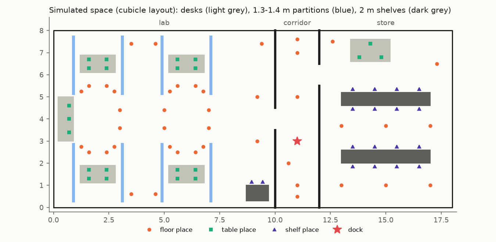
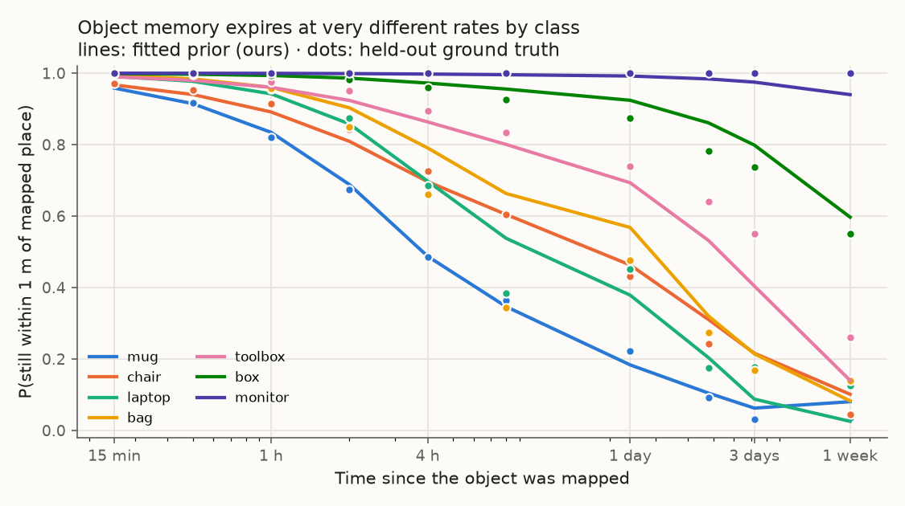
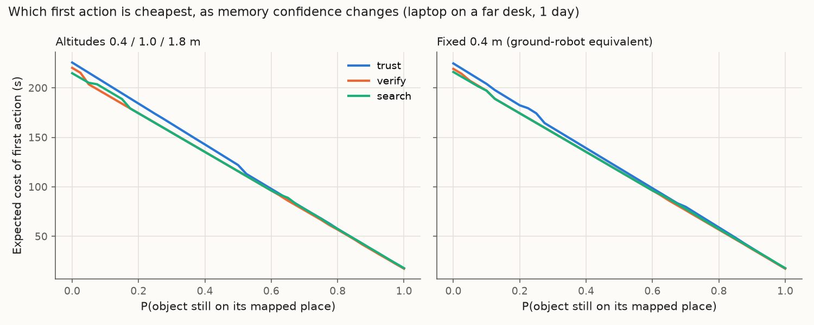
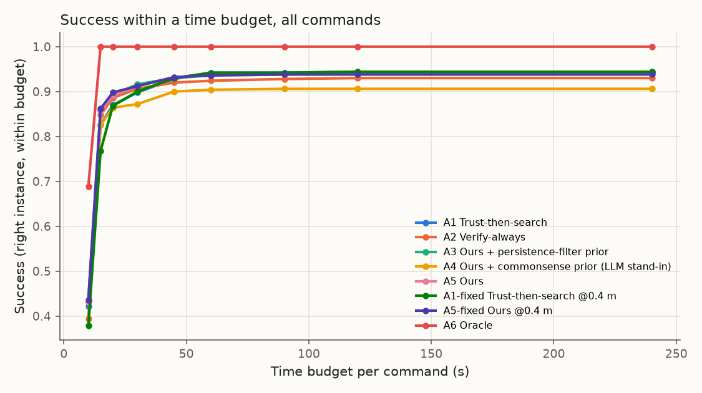
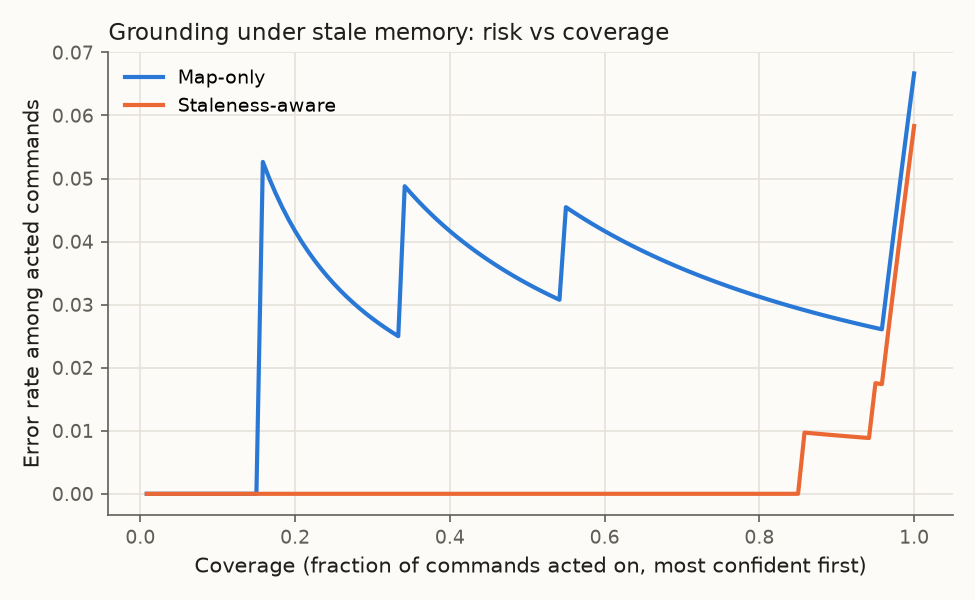

# Simulation results: Look Before You Fly (cubicle layout)

Seed 0 · 42 simulated days (28 train / 14 test) · 64 objects in 11 classes · 119 places · 492 viewpoints · runtime 19 s.

All numbers come from the simulator in `sim/`, not from real flights. The LLM and human priors are documented stand-ins (hand-set commonsense medians), not real model outputs. CIs are 95 % object-cluster bootstrap.

## E1 · Which prior predicts "still there"? (lower Brier is better)

11142 held-out object-time pairs from 64 objects, commands in working hours.

| Prior | Brier @ 1 h | Brier @ 24 h | Brier, all |
|---|---|---|---|
| Hier. Weibull + returns (ours) | 0.052 [0.040, 0.065] | 0.166 [0.138, 0.192] | 0.109 [0.091, 0.126] |
| Persistence filter (exp.) | 0.054 [0.041, 0.068] | 0.168 [0.142, 0.196] | 0.111 [0.093, 0.129] |
| Commonsense (LLM stand-in) | 0.053 [0.041, 0.066] | 0.242 [0.198, 0.285] | 0.147 [0.121, 0.172] |
| Human guesses (stand-in) | 0.053 [0.041, 0.066] | 0.242 [0.197, 0.288] | 0.147 [0.122, 0.173] |
| Global constant | 0.078 [0.069, 0.086] | 0.256 [0.212, 0.299] | 0.167 [0.143, 0.191] |

Per class (training move events, held-out empirical vs fitted P(still there)):

| Class | Train events | Empirical @ 1 h | Ours @ 1 h | Empirical @ 24 h | Ours @ 24 h |
|---|---|---|---|---|---|
| chair | 297 | 0.92 | 0.89 | 0.44 | 0.46 |
| stool | 15 | 0.97 | 0.97 | 0.78 | 0.84 |
| cart | 54 | 0.88 | 0.93 | 0.39 | 0.44 |
| bag | 169 | 0.92 | 0.96 | 0.48 | 0.57 |
| laptop | 194 | 0.94 | 0.94 | 0.44 | 0.38 |
| monitor (pooled, < 15 events) | 1 | 1.00 | 1.00 | 1.00 | 0.99 |
| box | 18 | 0.99 | 0.99 | 0.88 | 0.92 |
| bin (pooled, < 15 events) | 2 | 1.00 | 1.00 | 1.00 | 0.99 |
| plant (pooled, < 15 events) | 0 | 1.00 | 0.91 | 1.00 | 0.72 |
| toolbox | 44 | 0.97 | 0.96 | 0.74 | 0.69 |
| mug | 280 | 0.82 | 0.83 | 0.22 | 0.19 |

## E2 · Command trials (paired, common random numbers)

500 commands (250 per horizon), 96 with the object moved since mapping. Budget 240 s.

**Subset: all** (n = 500)

| Arm | Success (instance) | Success (intent) | Mean time (s) | Median time (s) | Energy (kJ) | Wasted looks | First actions |
|---|---|---|---|---|---|---|---|
| A1 Trust-then-search | 0.94 [0.91, 0.98] | 1.00 | 12.2 [11.0, 13.6] | 11.2 | 2.19 | 0.35 | trust 500 |
| A2 Verify-always | 0.93 [0.89, 0.97] | 1.00 | 11.6 [10.7, 12.7] | 11.1 | 2.09 | 0.41 | verify 500 |
| A3 Ours + persistence-filter prior | 0.94 [0.91, 0.97] | 1.00 | 11.5 [10.6, 12.6] | 10.9 | 2.08 | 0.36 | search 12, trust 73, verify 415 |
| A4 Ours + commonsense prior (LLM stand-in) | 0.91 [0.85, 0.95] | 1.00 | 11.2 [10.2, 12.4] | 9.9 | 2.01 | 0.33 | search 61, trust 42, verify 397 |
| A5 Ours | 0.94 [0.90, 0.97] | 1.00 | 11.5 [10.4, 12.5] | 10.9 | 2.07 | 0.37 | search 28, trust 62, verify 410 |
| A1-fixed Trust-then-search @0.4 m | 0.94 [0.91, 0.98] | 1.00 | 12.6 [11.4, 13.9] | 11.7 | 2.26 | 0.45 | trust 500 |
| A5-fixed Ours @0.4 m | 0.94 [0.90, 0.97] | 1.00 | 11.2 [10.3, 12.2] | 10.9 | 2.02 | 0.33 | search 28, trust 41, verify 431 |
| A6 Oracle | 1.00 [1.00, 1.00] | 1.00 | 7.7 [7.2, 8.3] | 7.4 | 1.39 | 0.00 | oracle 500 |

**Subset: 1h** (n = 250)

| Arm | Success (instance) | Success (intent) | Mean time (s) | Median time (s) | Energy (kJ) | Wasted looks | First actions |
|---|---|---|---|---|---|---|---|
| A1 Trust-then-search | 0.98 [0.97, 1.00] | 1.00 | 10.5 [9.6, 11.6] | 9.4 | 1.89 | 0.18 | trust 250 |
| A2 Verify-always | 0.97 [0.95, 0.99] | 1.00 | 10.7 [9.6, 11.8] | 10.1 | 1.92 | 0.24 | verify 250 |
| A3 Ours + persistence-filter prior | 0.98 [0.96, 1.00] | 1.00 | 10.7 [9.6, 12.0] | 9.4 | 1.93 | 0.22 | trust 50, verify 200 |
| A4 Ours + commonsense prior (LLM stand-in) | 0.98 [0.96, 1.00] | 1.00 | 10.4 [9.4, 11.3] | 9.7 | 1.87 | 0.16 | trust 35, verify 215 |
| A5 Ours | 0.98 [0.96, 1.00] | 1.00 | 10.6 [9.6, 11.7] | 9.7 | 1.90 | 0.20 | trust 35, verify 215 |
| A1-fixed Trust-then-search @0.4 m | 0.98 [0.97, 1.00] | 1.00 | 11.0 [9.9, 12.0] | 10.8 | 1.97 | 0.28 | trust 250 |
| A5-fixed Ours @0.4 m | 0.98 [0.96, 1.00] | 1.00 | 10.6 [9.5, 11.8] | 9.4 | 1.90 | 0.19 | trust 25, verify 225 |
| A6 Oracle | 1.00 [1.00, 1.00] | 1.00 | 7.6 [7.0, 8.2] | 7.4 | 1.37 | 0.00 | oracle 250 |

**Subset: 24h** (n = 250)

| Arm | Success (instance) | Success (intent) | Mean time (s) | Median time (s) | Energy (kJ) | Wasted looks | First actions |
|---|---|---|---|---|---|---|---|
| A1 Trust-then-search | 0.90 [0.84, 0.96] | 1.00 | 13.9 [12.1, 15.9] | 11.9 | 2.50 | 0.52 | trust 250 |
| A2 Verify-always | 0.89 [0.82, 0.95] | 1.00 | 12.6 [11.2, 14.0] | 11.5 | 2.26 | 0.57 | verify 250 |
| A3 Ours + persistence-filter prior | 0.90 [0.84, 0.96] | 1.00 | 12.4 [11.0, 13.7] | 11.4 | 2.23 | 0.49 | search 12, trust 23, verify 215 |
| A4 Ours + commonsense prior (LLM stand-in) | 0.83 [0.73, 0.92] | 1.00 | 12.0 [10.6, 13.4] | 10.1 | 2.15 | 0.50 | search 61, trust 7, verify 182 |
| A5 Ours | 0.90 [0.83, 0.95] | 1.00 | 12.4 [11.1, 13.8] | 11.4 | 2.23 | 0.54 | search 28, trust 27, verify 195 |
| A1-fixed Trust-then-search @0.4 m | 0.90 [0.84, 0.96] | 1.00 | 14.2 [12.4, 16.2] | 12.2 | 2.56 | 0.62 | trust 250 |
| A5-fixed Ours @0.4 m | 0.90 [0.83, 0.95] | 1.00 | 11.9 [10.8, 13.0] | 11.4 | 2.14 | 0.46 | search 28, trust 16, verify 206 |
| A6 Oracle | 1.00 [1.00, 1.00] | 1.00 | 7.8 [7.3, 8.4] | 7.7 | 1.41 | 0.00 | oracle 250 |

**Subset: moved** (n = 96)

| Arm | Success (instance) | Success (intent) | Mean time (s) | Median time (s) | Energy (kJ) | Wasted looks | First actions |
|---|---|---|---|---|---|---|---|
| A1 Trust-then-search | 0.73 [0.56, 0.88] | 1.00 | 22.2 [18.6, 26.6] | 16.2 | 3.99 | 1.62 | trust 96 |
| A2 Verify-always | 0.73 [0.57, 0.87] | 1.00 | 18.2 [14.7, 21.6] | 13.6 | 3.27 | 1.60 | verify 96 |
| A3 Ours + persistence-filter prior | 0.74 [0.58, 0.87] | 1.00 | 18.5 [15.0, 22.4] | 13.0 | 3.33 | 1.55 | search 4, trust 8, verify 84 |
| A4 Ours + commonsense prior (LLM stand-in) | 0.75 [0.58, 0.87] | 1.00 | 15.7 [12.9, 18.7] | 12.7 | 2.82 | 1.19 | search 40, trust 3, verify 53 |
| A5 Ours | 0.73 [0.56, 0.88] | 1.00 | 18.1 [15.1, 21.4] | 13.3 | 3.26 | 1.59 | search 18, trust 8, verify 70 |
| A1-fixed Trust-then-search @0.4 m | 0.73 [0.56, 0.87] | 1.00 | 22.0 [18.2, 26.1] | 17.2 | 3.96 | 1.65 | trust 96 |
| A5-fixed Ours @0.4 m | 0.73 [0.57, 0.87] | 1.00 | 16.9 [14.1, 20.3] | 13.2 | 3.05 | 1.40 | search 18, trust 4, verify 74 |
| A6 Oracle | 1.00 [1.00, 1.00] | 1.00 | 7.9 [7.3, 8.6] | 7.2 | 1.42 | 0.00 | oracle 96 |

**Subset: non-identical classes** (n = 412)

| Arm | Success (instance) | Success (intent) | Mean time (s) | Median time (s) | Energy (kJ) | Wasted looks | First actions |
|---|---|---|---|---|---|---|---|
| A1 Trust-then-search | 1.00 [1.00, 1.00] | 1.00 | 12.5 [11.1, 14.1] | 11.2 | 2.25 | 0.42 | trust 412 |
| A2 Verify-always | 1.00 [1.00, 1.00] | 1.00 | 12.0 [10.9, 13.3] | 11.2 | 2.17 | 0.49 | verify 412 |
| A3 Ours + persistence-filter prior | 1.00 [1.00, 1.00] | 1.00 | 11.9 [10.7, 13.3] | 10.9 | 2.14 | 0.43 | search 12, trust 61, verify 339 |
| A4 Ours + commonsense prior (LLM stand-in) | 1.00 [1.00, 1.00] | 1.00 | 11.6 [10.4, 12.9] | 10.8 | 2.09 | 0.40 | search 34, trust 36, verify 342 |
| A5 Ours | 1.00 [1.00, 1.00] | 1.00 | 11.8 [10.6, 13.1] | 11.1 | 2.13 | 0.45 | search 28, trust 53, verify 331 |
| A1-fixed Trust-then-search @0.4 m | 1.00 [1.00, 1.00] | 1.00 | 13.0 [11.7, 14.5] | 11.8 | 2.34 | 0.54 | trust 412 |
| A5-fixed Ours @0.4 m | 1.00 [1.00, 1.00] | 1.00 | 11.5 [10.4, 12.8] | 10.9 | 2.07 | 0.39 | search 28, trust 35, verify 349 |
| A6 Oracle | 1.00 [1.00, 1.00] | 1.00 | 7.8 [7.2, 8.4] | 7.4 | 1.40 | 0.00 | oracle 412 |

### Pre-registered primary test

A5 Ours vs the better naive baseline (A1 Trust-then-search) on instance success, exact McNemar: 0.940 vs 0.944, discordant 3 (ours only) / 5 (baseline only), **p = 0.727**.

Secondary (Holm-adjusted, instance success):

| Comparison | p | p (Holm) | First arm only | Second arm only |
|---|---|---|---|---|
| A5 vs A5-fixed (altitude) | 1.000 | 1.000 | 1 | 0 |
| A1 vs A1-fixed (altitude, trust) | 1.000 | 1.000 | 0 | 0 |
| A5 vs A3 (prior) | 1.000 | 1.000 | 0 | 1 |
| A5 vs A4 (prior) | 0.000 | 0.001 | 19 | 2 |

Paired mean time difference (first minus second, failures count as the full budget):

| Comparison | Δ time (s) |
|---|---|
| A5 Ours − A1 Trust-then-search | -0.70 [-1.21, -0.22] |
| A5 Ours − A2 Verify-always | -0.13 [-0.62, +0.32] |
| A5 Ours − A5-fixed Ours @0.4 m | +0.25 [+0.02, +0.66] |
| A1 Trust-then-search − A1-fixed Trust-then-search @0.4 m | -0.39 [-0.74, -0.05] |
| A5 Ours − A3 Ours + persistence-filter prior | -0.06 [-0.47, +0.42] |

### Success within a time budget

| Arm | 10 s | 15 s | 20 s | 30 s | 45 s | 60 s | 90 s | 120 s | 240 s |
|---|---|---|---|---|---|---|---|---|---|
| A1 Trust-then-search | 0.42 | 0.83 | 0.87 | 0.90 | 0.93 | 0.94 | 0.94 | 0.94 | 0.94 |
| A2 Verify-always | 0.39 | 0.85 | 0.89 | 0.91 | 0.92 | 0.92 | 0.93 | 0.93 | 0.93 |
| A3 Ours + persistence-filter prior | 0.43 | 0.86 | 0.89 | 0.92 | 0.93 | 0.94 | 0.94 | 0.94 | 0.94 |
| A4 Ours + commonsense prior (LLM stand-in) | 0.43 | 0.83 | 0.86 | 0.87 | 0.90 | 0.90 | 0.91 | 0.91 | 0.91 |
| A5 Ours | 0.43 | 0.86 | 0.89 | 0.91 | 0.93 | 0.94 | 0.94 | 0.94 | 0.94 |
| A1-fixed Trust-then-search @0.4 m | 0.38 | 0.77 | 0.87 | 0.90 | 0.93 | 0.94 | 0.94 | 0.94 | 0.94 |
| A5-fixed Ours @0.4 m | 0.44 | 0.86 | 0.90 | 0.91 | 0.93 | 0.94 | 0.94 | 0.94 | 0.94 |
| A6 Oracle | 0.69 | 1.00 | 1.00 | 1.00 | 1.00 | 1.00 | 1.00 | 1.00 | 1.00 |

### Decision analysis (laptop on a far desk, 1 day after mapping)

- All altitudes: search for p in [0.00, 0.03]; verify for p in [0.05, 1.00]
- Fixed 0.4 m: search for p in [0.00, 0.08]; verify for p in [0.10, 1.00]

## E3 · Grounding language references under stale memory

Conformal α = 0.1; half the 600 commands calibrate, half test.

| Resolver | Argmax accuracy | Coverage | Ask rate | Ask rate when ambiguous | Accuracy when acting | Acted (unambiguous) |
|---|---|---|---|---|---|---|
| Map-only | 0.933 | 0.917 | 0.600 | 0.961 | 0.973 | 0.942 |
| Staleness-aware | 0.942 | 0.917 | 0.613 | 0.972 | 0.991 | 0.925 |

## Figures

