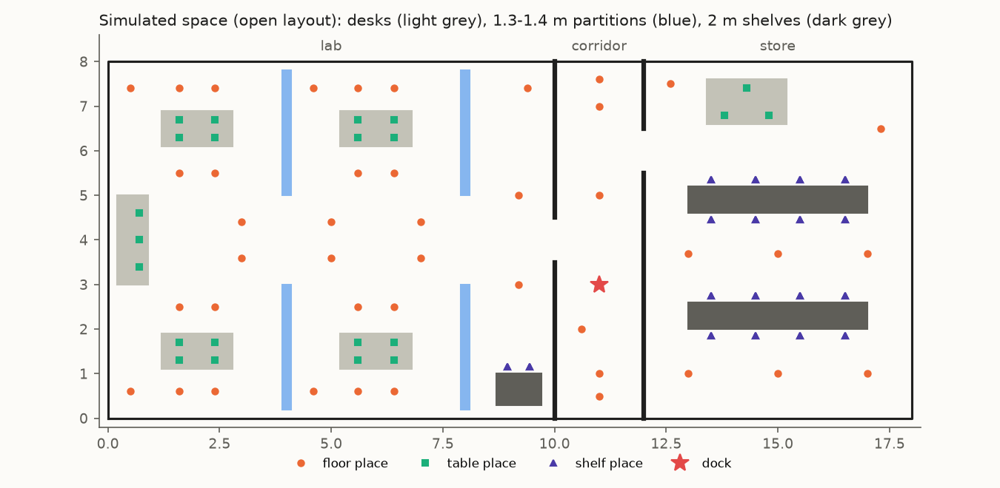
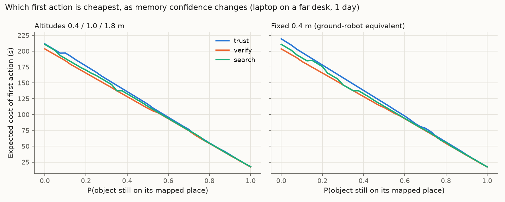
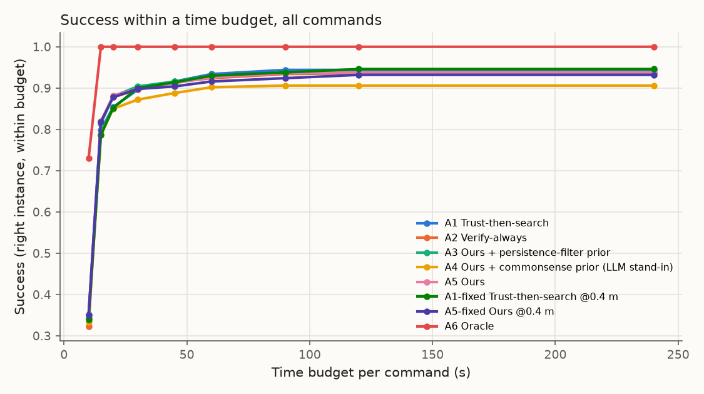
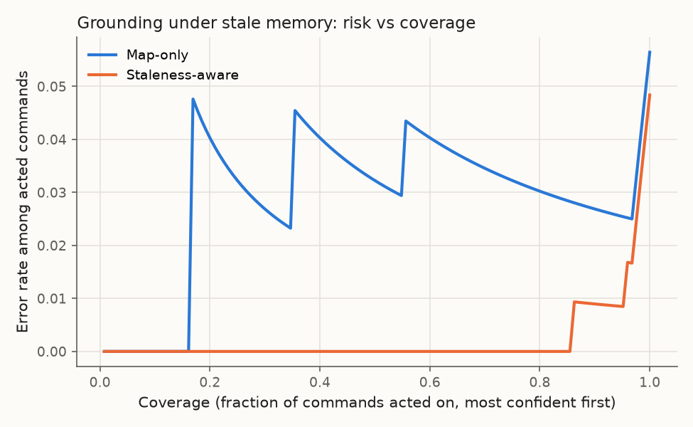

# Simulation results: Look Before You Fly (open layout)

Seed 0 · 42 simulated days (28 train / 14 test) · 64 objects in 11 classes · 119 places · 576 viewpoints · runtime 21 s.

All numbers come from the simulator in `sim/`, not from real flights. The LLM and human priors are documented stand-ins (hand-set commonsense medians), not real model outputs. CIs are 95 % object-cluster bootstrap.

## E1 · Which prior predicts "still there"? (lower Brier is better)

11142 held-out object-time pairs from 64 objects, commands in working hours.

| Prior | Brier @ 1 h | Brier @ 24 h | Brier, all |
|---|---|---|---|
| Hier. Weibull + returns (ours) | 0.052 [0.040, 0.065] | 0.166 [0.138, 0.192] | 0.109 [0.091, 0.126] |
| Persistence filter (exp.) | 0.054 [0.041, 0.068] | 0.168 [0.142, 0.196] | 0.111 [0.093, 0.129] |
| Commonsense (LLM stand-in) | 0.053 [0.041, 0.066] | 0.242 [0.198, 0.285] | 0.147 [0.121, 0.172] |
| Human guesses (stand-in) | 0.053 [0.041, 0.066] | 0.242 [0.197, 0.288] | 0.147 [0.122, 0.173] |
| Global constant | 0.078 [0.069, 0.086] | 0.256 [0.212, 0.299] | 0.167 [0.143, 0.191] |

Per class (training move events, held-out empirical vs fitted P(still there)):

| Class | Train events | Empirical @ 1 h | Ours @ 1 h | Empirical @ 24 h | Ours @ 24 h |
|---|---|---|---|---|---|
| chair | 297 | 0.92 | 0.89 | 0.44 | 0.46 |
| stool | 15 | 0.97 | 0.97 | 0.78 | 0.84 |
| cart | 54 | 0.88 | 0.93 | 0.39 | 0.44 |
| bag | 169 | 0.92 | 0.96 | 0.48 | 0.57 |
| laptop | 194 | 0.94 | 0.94 | 0.44 | 0.38 |
| monitor (pooled, < 15 events) | 1 | 1.00 | 1.00 | 1.00 | 0.99 |
| box | 18 | 0.99 | 0.99 | 0.88 | 0.92 |
| bin (pooled, < 15 events) | 2 | 1.00 | 1.00 | 1.00 | 0.99 |
| plant (pooled, < 15 events) | 0 | 1.00 | 0.91 | 1.00 | 0.72 |
| toolbox | 44 | 0.97 | 0.96 | 0.74 | 0.69 |
| mug | 280 | 0.82 | 0.83 | 0.22 | 0.19 |

## E2 · Command trials (paired, common random numbers)

500 commands (250 per horizon), 96 with the object moved since mapping. Budget 240 s.

**Subset: all** (n = 500)

| Arm | Success (instance) | Success (intent) | Mean time (s) | Median time (s) | Energy (kJ) | Wasted looks | First actions |
|---|---|---|---|---|---|---|---|
| A1 Trust-then-search | 0.94 [0.91, 0.98] | 1.00 | 13.1 [11.7, 14.7] | 11.1 | 2.36 | 0.38 | trust 500 |
| A2 Verify-always | 0.94 [0.89, 0.97] | 1.00 | 12.7 [11.5, 14.0] | 11.2 | 2.28 | 0.43 | verify 500 |
| A3 Ours + persistence-filter prior | 0.94 [0.90, 0.97] | 1.00 | 12.4 [11.3, 13.6] | 11.1 | 2.24 | 0.39 | search 9, trust 44, verify 447 |
| A4 Ours + commonsense prior (LLM stand-in) | 0.91 [0.85, 0.95] | 1.00 | 11.9 [10.8, 13.3] | 10.6 | 2.15 | 0.35 | search 60, trust 34, verify 406 |
| A5 Ours | 0.94 [0.90, 0.97] | 1.00 | 12.6 [11.4, 13.9] | 11.1 | 2.27 | 0.41 | search 17, trust 37, verify 446 |
| A1-fixed Trust-then-search @0.4 m | 0.95 [0.91, 0.97] | 1.00 | 13.5 [12.0, 15.3] | 11.2 | 2.43 | 0.45 | trust 500 |
| A5-fixed Ours @0.4 m | 0.93 [0.89, 0.97] | 1.00 | 12.7 [11.2, 14.5] | 10.9 | 2.29 | 0.46 | search 30, trust 40, verify 430 |
| A6 Oracle | 1.00 [1.00, 1.00] | 1.00 | 8.2 [7.6, 8.8] | 8.4 | 1.47 | 0.00 | oracle 500 |

**Subset: 1h** (n = 250)

| Arm | Success (instance) | Success (intent) | Mean time (s) | Median time (s) | Energy (kJ) | Wasted looks | First actions |
|---|---|---|---|---|---|---|---|
| A1 Trust-then-search | 0.99 [0.97, 1.00] | 1.00 | 10.8 [9.9, 11.7] | 10.6 | 1.95 | 0.15 | trust 250 |
| A2 Verify-always | 0.98 [0.95, 1.00] | 1.00 | 11.3 [10.1, 12.6] | 10.6 | 2.03 | 0.26 | verify 250 |
| A3 Ours + persistence-filter prior | 0.98 [0.96, 1.00] | 1.00 | 11.1 [9.9, 12.3] | 10.6 | 1.99 | 0.19 | trust 33, verify 217 |
| A4 Ours + commonsense prior (LLM stand-in) | 0.98 [0.97, 1.00] | 1.00 | 10.8 [9.8, 11.9] | 10.6 | 1.95 | 0.14 | trust 26, verify 224 |
| A5 Ours | 0.98 [0.96, 1.00] | 1.00 | 11.1 [10.0, 12.4] | 10.6 | 2.00 | 0.18 | trust 24, verify 226 |
| A1-fixed Trust-then-search @0.4 m | 0.99 [0.97, 1.00] | 1.00 | 10.9 [9.9, 11.8] | 10.6 | 1.95 | 0.15 | trust 250 |
| A5-fixed Ours @0.4 m | 0.98 [0.97, 1.00] | 1.00 | 11.2 [10.0, 12.7] | 10.6 | 2.01 | 0.19 | trust 33, verify 217 |
| A6 Oracle | 1.00 [1.00, 1.00] | 1.00 | 8.0 [7.3, 8.7] | 8.3 | 1.45 | 0.00 | oracle 250 |

**Subset: 24h** (n = 250)

| Arm | Success (instance) | Success (intent) | Mean time (s) | Median time (s) | Energy (kJ) | Wasted looks | First actions |
|---|---|---|---|---|---|---|---|
| A1 Trust-then-search | 0.90 [0.83, 0.96] | 1.00 | 15.4 [13.1, 17.8] | 11.9 | 2.78 | 0.61 | trust 250 |
| A2 Verify-always | 0.90 [0.83, 0.95] | 1.00 | 14.1 [12.2, 16.3] | 11.6 | 2.54 | 0.59 | verify 250 |
| A3 Ours + persistence-filter prior | 0.90 [0.83, 0.95] | 1.00 | 13.8 [12.0, 15.6] | 11.8 | 2.48 | 0.59 | search 9, trust 11, verify 230 |
| A4 Ours + commonsense prior (LLM stand-in) | 0.83 [0.73, 0.92] | 1.00 | 13.0 [11.3, 14.9] | 10.7 | 2.34 | 0.56 | search 60, trust 8, verify 182 |
| A5 Ours | 0.90 [0.82, 0.95] | 1.00 | 14.2 [12.4, 16.1] | 11.9 | 2.55 | 0.63 | search 17, trust 13, verify 220 |
| A1-fixed Trust-then-search @0.4 m | 0.90 [0.84, 0.96] | 1.00 | 16.2 [13.5, 19.1] | 11.9 | 2.92 | 0.74 | trust 250 |
| A5-fixed Ours @0.4 m | 0.88 [0.81, 0.95] | 1.00 | 14.3 [12.0, 16.9] | 11.2 | 2.57 | 0.73 | search 30, trust 7, verify 213 |
| A6 Oracle | 1.00 [1.00, 1.00] | 1.00 | 8.3 [7.6, 8.8] | 8.5 | 1.49 | 0.00 | oracle 250 |

**Subset: moved** (n = 96)

| Arm | Success (instance) | Success (intent) | Mean time (s) | Median time (s) | Energy (kJ) | Wasted looks | First actions |
|---|---|---|---|---|---|---|---|
| A1 Trust-then-search | 0.73 [0.57, 0.87] | 1.00 | 25.2 [20.9, 30.4] | 20.5 | 4.55 | 1.78 | trust 96 |
| A2 Verify-always | 0.74 [0.58, 0.88] | 1.00 | 22.1 [17.5, 27.4] | 14.7 | 3.99 | 1.77 | verify 96 |
| A3 Ours + persistence-filter prior | 0.73 [0.56, 0.88] | 1.00 | 21.3 [17.0, 26.1] | 14.7 | 3.83 | 1.74 | search 3, trust 2, verify 91 |
| A4 Ours + commonsense prior (LLM stand-in) | 0.76 [0.60, 0.88] | 1.00 | 18.8 [14.6, 23.7] | 13.0 | 3.40 | 1.41 | search 34, trust 2, verify 60 |
| A5 Ours | 0.73 [0.56, 0.88] | 1.00 | 22.1 [17.4, 27.7] | 14.3 | 3.99 | 1.79 | search 9, trust 3, verify 84 |
| A1-fixed Trust-then-search @0.4 m | 0.74 [0.58, 0.87] | 1.00 | 26.8 [21.3, 32.7] | 19.7 | 4.82 | 2.02 | trust 96 |
| A5-fixed Ours @0.4 m | 0.73 [0.57, 0.87] | 1.00 | 23.0 [17.1, 30.4] | 13.9 | 4.15 | 2.04 | search 17, trust 1, verify 78 |
| A6 Oracle | 1.00 [1.00, 1.00] | 1.00 | 8.3 [7.5, 9.0] | 8.2 | 1.49 | 0.00 | oracle 96 |

**Subset: non-identical classes** (n = 412)

| Arm | Success (instance) | Success (intent) | Mean time (s) | Median time (s) | Energy (kJ) | Wasted looks | First actions |
|---|---|---|---|---|---|---|---|
| A1 Trust-then-search | 1.00 [1.00, 1.00] | 1.00 | 13.5 [11.9, 15.2] | 11.2 | 2.43 | 0.45 | trust 412 |
| A2 Verify-always | 1.00 [1.00, 1.00] | 1.00 | 13.1 [11.7, 14.8] | 11.3 | 2.36 | 0.51 | verify 412 |
| A3 Ours + persistence-filter prior | 1.00 [1.00, 1.00] | 1.00 | 12.8 [11.4, 14.3] | 11.2 | 2.30 | 0.47 | search 9, trust 39, verify 364 |
| A4 Ours + commonsense prior (LLM stand-in) | 1.00 [1.00, 1.00] | 1.00 | 12.6 [11.2, 14.0] | 11.2 | 2.26 | 0.42 | search 27, trust 34, verify 351 |
| A5 Ours | 1.00 [1.00, 1.00] | 1.00 | 13.0 [11.6, 14.7] | 11.2 | 2.35 | 0.49 | search 17, trust 35, verify 360 |
| A1-fixed Trust-then-search @0.4 m | 1.00 [1.00, 1.00] | 1.00 | 14.0 [12.2, 15.9] | 11.2 | 2.51 | 0.53 | trust 412 |
| A5-fixed Ours @0.4 m | 1.00 [1.00, 1.00] | 1.00 | 13.4 [11.7, 15.5] | 11.2 | 2.41 | 0.55 | search 17, trust 35, verify 360 |
| A6 Oracle | 1.00 [1.00, 1.00] | 1.00 | 8.2 [7.6, 8.8] | 8.4 | 1.48 | 0.00 | oracle 412 |

### Pre-registered primary test

A5 Ours vs the better naive baseline (A1 Trust-then-search) on instance success, exact McNemar: 0.938 vs 0.944, discordant 2 (ours only) / 5 (baseline only), **p = 0.453**.

Secondary (Holm-adjusted, instance success):

| Comparison | p | p (Holm) | First arm only | Second arm only |
|---|---|---|---|---|
| A5 vs A5-fixed (altitude) | 0.453 | 1.000 | 5 | 2 |
| A1 vs A1-fixed (altitude, trust) | 1.000 | 1.000 | 0 | 1 |
| A5 vs A3 (prior) | 1.000 | 1.000 | 0 | 0 |
| A5 vs A4 (prior) | 0.002 | 0.010 | 21 | 5 |

Paired mean time difference (first minus second, failures count as the full budget):

| Comparison | Δ time (s) |
|---|---|
| A5 Ours − A1 Trust-then-search | -0.49 [-1.01, +0.13] |
| A5 Ours − A2 Verify-always | -0.06 [-0.53, +0.47] |
| A5 Ours − A5-fixed Ours @0.4 m | -0.09 [-0.64, +0.43] |
| A1 Trust-then-search − A1-fixed Trust-then-search @0.4 m | -0.40 [-0.96, +0.07] |
| A5 Ours − A3 Ours + persistence-filter prior | +0.20 [-0.05, +0.56] |

### Success within a time budget

| Arm | 10 s | 15 s | 20 s | 30 s | 45 s | 60 s | 90 s | 120 s | 240 s |
|---|---|---|---|---|---|---|---|---|---|
| A1 Trust-then-search | 0.35 | 0.80 | 0.85 | 0.90 | 0.92 | 0.93 | 0.94 | 0.94 | 0.94 |
| A2 Verify-always | 0.32 | 0.82 | 0.88 | 0.90 | 0.91 | 0.92 | 0.93 | 0.94 | 0.94 |
| A3 Ours + persistence-filter prior | 0.34 | 0.81 | 0.88 | 0.90 | 0.92 | 0.93 | 0.94 | 0.94 | 0.94 |
| A4 Ours + commonsense prior (LLM stand-in) | 0.33 | 0.79 | 0.85 | 0.87 | 0.89 | 0.90 | 0.91 | 0.91 | 0.91 |
| A5 Ours | 0.34 | 0.82 | 0.88 | 0.90 | 0.91 | 0.93 | 0.94 | 0.94 | 0.94 |
| A1-fixed Trust-then-search @0.4 m | 0.34 | 0.79 | 0.85 | 0.90 | 0.91 | 0.93 | 0.94 | 0.95 | 0.95 |
| A5-fixed Ours @0.4 m | 0.35 | 0.82 | 0.88 | 0.90 | 0.90 | 0.92 | 0.92 | 0.93 | 0.93 |
| A6 Oracle | 0.73 | 1.00 | 1.00 | 1.00 | 1.00 | 1.00 | 1.00 | 1.00 | 1.00 |

### Decision analysis (laptop on a far desk, 1 day after mapping)

- All altitudes: verify for p in [0.00, 1.00]
- Fixed 0.4 m: verify for p in [0.00, 1.00]

## E3 · Grounding language references under stale memory

Conformal α = 0.1; half the 600 commands calibrate, half test.

| Resolver | Argmax accuracy | Coverage | Ask rate | Ask rate when ambiguous | Accuracy when acting | Acted (unambiguous) |
|---|---|---|---|---|---|---|
| Map-only | 0.944 | 0.927 | 0.583 | 0.960 | 0.975 | 0.952 |
| Staleness-aware | 0.952 | 0.927 | 0.597 | 0.971 | 0.991 | 0.935 |

## Figures

