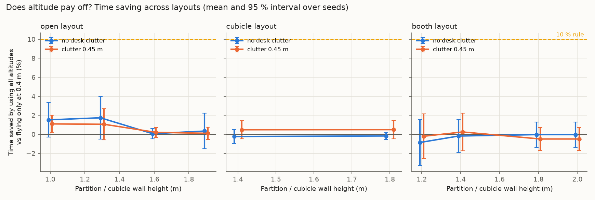
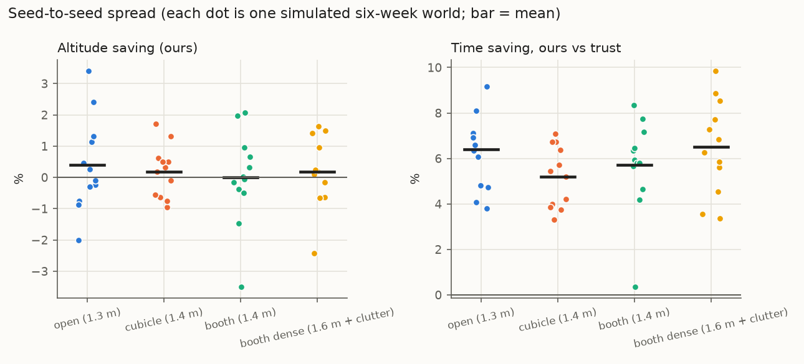
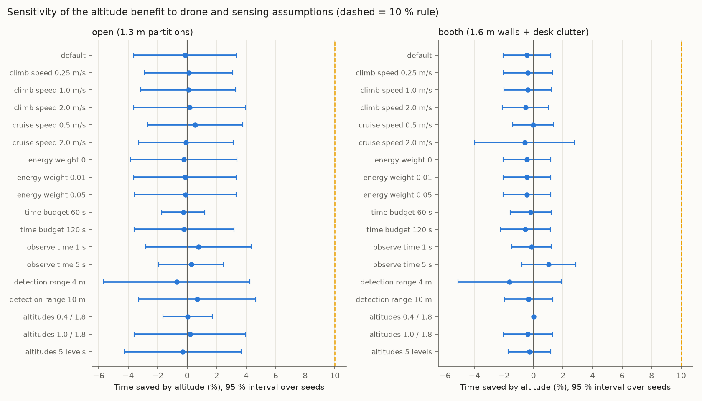
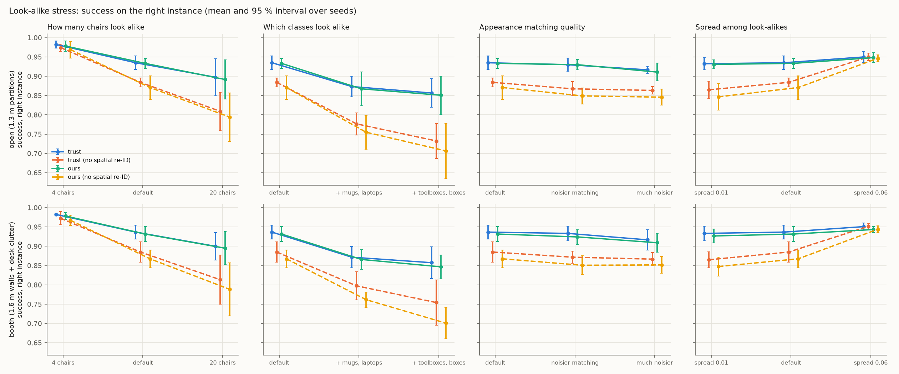

# Stage 2: stress-testing the simulated claims

Runtime 0 s. Everything here comes from the simulator (`sim/`), not from real flights. Seeds are the independent unit; intervals are Student-t 95 % across seeds. Stand-in priors are hand-set, not real LLM output.

## Decision rules (written before running the sweeps)

- **Altitude stays a main claim** only if some layout in the swept range (walls 1.0–2.0 m, clutter 0–0.45 m, default drone speeds) saves **≥ 10 %** time by using all altitudes instead of 0.4 m only, with the 95 % interval above 0.
- If **no** layout reaches 3 %, the paper leads with the prior-method benchmark and look-alike re-identification instead.

## Verdict on the altitude claim

**FAIL.** Best layout: open layout, walls 1.3 m, clutter 0.0 m, saving 1.7 % [-0.5, 4.0] (moved objects only: 6.2 % [-0.3, 12.7]). 0 of 20 layouts meet the 10 % rule; 0 reach 3 % with interval above 0.

## 1. Layout sweep

20 layouts × 6 seeds, 300 commands per run. "Altitude saving" = 1 − mean time with all altitudes / mean time at 0.4 m only, same policy, same commands.

| Layout | Walls (m) | Clutter (m) | Altitude saving (ours) | … moved objects only | Always 1.8 m vs always 0.4 m | Altitude saving (trust baseline) | Ours vs trust: time saving | Ours − trust: success |
|---|---|---|---|---|---|---|---|---|
| booth | 1.2 | 0.0 | -0.9 % [-3.3, +1.5] | -3.1 % [-9.5, +3.3] | +2.4 % [+0.8, +4.0] | +4.2 % [+3.0, +5.5] | +5.6 % [+2.3, +8.8] | 0.002 [-0.008, 0.011] |
| booth | 1.4 | 0.0 | -0.2 % [-1.9, +1.6] | +0.4 % [-4.7, +5.4] | +1.9 % [+1.0, +2.8] | +4.1 % [+2.9, +5.3] | +6.4 % [+3.2, +9.5] | -0.000 [-0.007, 0.007] |
| booth | 1.8 | 0.0 | -0.0 % [-1.4, +1.3] | -0.2 % [-3.9, +3.6] | +1.5 % [-0.2, +3.1] | +4.3 % [+3.0, +5.5] | +6.3 % [+2.3, +10.3] | -0.000 [-0.009, 0.009] |
| booth | 2.0 | 0.0 | -0.0 % [-1.4, +1.3] | -0.2 % [-3.9, +3.6] | +1.4 % [-0.2, +3.1] | +4.3 % [+3.0, +5.5] | +6.3 % [+2.3, +10.3] | -0.000 [-0.009, 0.009] |
| booth | 1.2 | 0.45 | -0.2 % [-2.6, +2.2] | -2.1 % [-9.7, +5.5] | +2.5 % [+0.8, +4.2] | +4.1 % [+2.3, +5.8] | +6.6 % [+3.7, +9.6] | 0.002 [-0.008, 0.011] |
| booth | 1.4 | 0.45 | +0.3 % [-1.7, +2.2] | +0.5 % [-6.2, +7.1] | +0.9 % [-0.8, +2.5] | +3.1 % [+0.7, +5.6] | +7.9 % [+5.0, +10.9] | -0.000 [-0.007, 0.007] |
| booth | 1.8 | 0.45 | -0.5 % [-1.7, +0.7] | -1.8 % [-5.5, +1.8] | +1.0 % [-1.8, +3.7] | +3.4 % [+1.0, +5.9] | +7.0 % [+4.1, +9.8] | -0.000 [-0.009, 0.009] |
| booth | 2.0 | 0.45 | -0.5 % [-1.7, +0.7] | -1.8 % [-5.5, +1.8] | +1.0 % [-1.8, +3.7] | +3.4 % [+1.0, +5.9] | +7.0 % [+4.1, +9.8] | -0.000 [-0.009, 0.009] |
| cubicle | 1.4 | 0.0 | -0.2 % [-1.0, +0.5] | -0.8 % [-3.5, +2.0] | +0.1 % [-1.3, +1.4] | +4.2 % [+2.4, +6.0] | +5.4 % [+2.7, +8.1] | 0.004 [-0.002, 0.009] |
| cubicle | 1.8 | 0.0 | -0.2 % [-0.5, +0.2] | -0.7 % [-2.2, +0.8] | +0.0 % [-0.9, +1.0] | +4.2 % [+2.4, +6.0] | +5.5 % [+3.1, +7.9] | 0.004 [-0.002, 0.009] |
| cubicle | 1.4 | 0.45 | +0.5 % [-0.5, +1.4] | +1.2 % [-1.8, +4.2] | +0.6 % [-1.1, +2.3] | +4.0 % [+2.5, +5.5] | +6.1 % [+4.8, +7.4] | 0.004 [-0.002, 0.009] |
| cubicle | 1.8 | 0.45 | +0.5 % [-0.5, +1.5] | +1.1 % [-1.9, +4.1] | +0.4 % [-0.0, +0.9] | +4.0 % [+2.5, +5.5] | +6.1 % [+4.8, +7.4] | 0.004 [-0.002, 0.009] |
| open | 1.0 | 0.0 | +1.5 % [-0.3, +3.4] | +6.1 % [+0.8, +11.4] | +3.3 % [+0.8, +5.8] | +2.0 % [-0.0, +4.0] | +6.9 % [+4.0, +9.8] | -0.002 [-0.007, 0.004] |
| open | 1.3 | 0.0 | +1.7 % [-0.5, +4.0] | +6.2 % [-0.3, +12.7] | +2.1 % [+0.3, +3.9] | +2.1 % [+0.3, +3.9] | +7.0 % [+4.4, +9.5] | -0.001 [-0.005, 0.004] |
| open | 1.6 | 0.0 | +0.1 % [-0.5, +0.6] | -0.2 % [-1.8, +1.4] | +1.3 % [-0.3, +2.9] | +1.5 % [+0.5, +2.4] | +6.6 % [+3.6, +9.6] | -0.004 [-0.009, 0.001] |
| open | 1.9 | 0.0 | +0.3 % [-1.5, +2.2] | +0.2 % [-5.7, +6.1] | +1.3 % [-0.2, +2.9] | +1.5 % [+0.5, +2.4] | +6.9 % [+3.4, +10.3] | -0.004 [-0.009, 0.001] |
| open | 1.0 | 0.45 | +1.1 % [+0.2, +2.0] | +3.4 % [+0.4, +6.3] | +2.6 % [+1.5, +3.8] | +0.9 % [-0.9, +2.7] | +7.5 % [+4.8, +10.2] | -0.002 [-0.007, 0.004] |
| open | 1.3 | 0.45 | +1.1 % [-0.6, +2.7] | +3.3 % [-1.8, +8.3] | +1.7 % [-0.1, +3.5] | +1.5 % [-0.4, +3.3] | +6.9 % [+5.0, +8.9] | -0.001 [-0.005, 0.004] |
| open | 1.6 | 0.45 | +0.2 % [-0.3, +0.7] | +0.0 % [-1.2, +1.3] | +0.3 % [-0.9, +1.4] | +0.2 % [-2.3, +2.6] | +7.9 % [+3.4, +12.4] | -0.004 [-0.009, 0.001] |
| open | 1.9 | 0.45 | +0.1 % [-0.5, +0.8] | -0.4 % [-1.9, +1.1] | +0.4 % [-0.2, +0.9] | +0.2 % [-2.3, +2.7] | +7.8 % [+3.4, +12.2] | -0.004 [-0.009, 0.001] |

Best case for altitude, flying *always* at 1.8 m: open layout, walls 1.0 m, clutter 0.0 m, saving 3.3 % [0.8, 5.8]. This is not the pre-registered metric (it compares two fixed heights instead of letting the policy choose), and it still stays below the 10 % rule.

Mean time (s) by altitude set, same policy (dose–response):

| Layout | Walls | Clutter | trust | ours @0.4 | ours @1.0 | ours @1.8 | ours (all) | oracle |
|---|---|---|---|---|---|---|---|---|
| booth | 1.2 | 0.0 | 12.33 | 11.53 | 11.58 | 11.25 | 11.63 | 7.69 |
| booth | 1.4 | 0.0 | 12.34 | 11.53 | 11.58 | 11.31 | 11.55 | 7.69 |
| booth | 1.8 | 0.0 | 12.32 | 11.53 | 11.54 | 11.37 | 11.53 | 7.69 |
| booth | 2.0 | 0.0 | 12.32 | 11.53 | 11.54 | 11.37 | 11.53 | 7.69 |
| booth | 1.2 | 0.45 | 12.41 | 11.56 | 11.61 | 11.26 | 11.58 | 7.69 |
| booth | 1.4 | 0.45 | 12.53 | 11.56 | 11.61 | 11.46 | 11.53 | 7.69 |
| booth | 1.8 | 0.45 | 12.49 | 11.56 | 11.58 | 11.45 | 11.61 | 7.69 |
| booth | 2.0 | 0.45 | 12.49 | 11.56 | 11.58 | 11.45 | 11.61 | 7.69 |
| cubicle | 1.4 | 0.0 | 11.51 | 10.85 | 10.87 | 10.84 | 10.87 | 7.60 |
| cubicle | 1.8 | 0.0 | 11.51 | 10.85 | 10.87 | 10.85 | 10.87 | 7.60 |
| cubicle | 1.4 | 0.45 | 11.57 | 10.92 | 10.86 | 10.85 | 10.86 | 7.60 |
| cubicle | 1.8 | 0.45 | 11.57 | 10.92 | 10.86 | 10.87 | 10.86 | 7.60 |
| open | 1.0 | 0.0 | 12.48 | 11.80 | 11.76 | 11.40 | 11.62 | 8.01 |
| open | 1.3 | 0.0 | 12.46 | 11.80 | 11.75 | 11.54 | 11.59 | 8.01 |
| open | 1.6 | 0.0 | 12.59 | 11.76 | 11.74 | 11.60 | 11.75 | 8.01 |
| open | 1.9 | 0.0 | 12.59 | 11.76 | 11.74 | 11.60 | 11.71 | 8.01 |
| open | 1.0 | 0.45 | 12.69 | 11.86 | 11.86 | 11.55 | 11.73 | 8.01 |
| open | 1.3 | 0.45 | 12.61 | 11.86 | 11.87 | 11.66 | 11.73 | 8.01 |
| open | 1.6 | 0.45 | 12.83 | 11.82 | 11.85 | 11.78 | 11.79 | 8.01 |
| open | 1.9 | 0.45 | 12.83 | 11.82 | 11.88 | 11.77 | 11.80 | 8.01 |

## 2. Seed robustness (12 independent six-week worlds per layout)

| Layout | Success: ours | Success: trust | Ours − trust | Time saving vs trust | … moved only | Time saving vs verify-always | Altitude saving |
|---|---|---|---|---|---|---|---|
| open (1.3 m) | 0.939 [0.933, 0.946] | 0.941 [0.933, 0.948] | -0.001 [-0.004, 0.001] | +6.4 % [+5.2, +7.6] | +19.5 % [+16.2, +22.8] | +1.4 % [+0.3, +2.6] | +0.4 % [-0.6, +1.3] |
| cubicle (1.4 m) | 0.941 [0.935, 0.947] | 0.941 [0.934, 0.948] | 0.000 [-0.002, 0.003] | +5.2 % [+4.3, +6.1] | +16.9 % [+14.9, +18.9] | +2.3 % [+1.4, +3.2] | +0.2 % [-0.3, +0.7] |
| booth (1.4 m) | 0.940 [0.933, 0.946] | 0.942 [0.935, 0.949] | -0.002 [-0.005, 0.000] | +5.7 % [+4.4, +7.0] | +17.4 % [+14.2, +20.6] | +1.7 % [+0.7, +2.7] | -0.0 % [-1.0, +0.9] |
| booth dense (1.6 m + clutter) | 0.939 [0.932, 0.946] | 0.942 [0.935, 0.949] | -0.003 [-0.005, -0.001] | +6.5 % [+5.2, +7.8] | +18.9 % [+16.0, +21.9] | +2.0 % [+0.9, +3.2] | +0.2 % [-0.5, +0.9] |

**Effect of the prior inside the policy** (success difference vs our fitted prior):

| Layout | Commonsense (LLM stand-in) − ours | Persistence filter − ours |
|---|---|---|
| open (1.3 m) | -0.028 [-0.036, -0.021] | 0.001 [0.000, 0.001] |
| cubicle (1.4 m) | -0.031 [-0.039, -0.023] | -0.000 [-0.002, 0.001] |
| booth (1.4 m) | -0.030 [-0.037, -0.024] | 0.000 [-0.001, 0.001] |
| booth dense (1.6 m + clutter) | -0.029 [-0.035, -0.023] | 0.001 [-0.001, 0.003] |

**E1 across seeds** (Brier, lower is better; first layout shown, the world dynamics are the same in all layouts):

| Prior | Brier, all | Brier @ 24 h |
|---|---|---|
| Hier. Weibull + returns (ours) | 0.111 [0.108, 0.114] | 0.166 [0.161, 0.171] |
| Persistence filter (exp.) | 0.114 [0.111, 0.116] | 0.168 [0.164, 0.173] |
| Human guesses (stand-in) | 0.146 [0.142, 0.149] | 0.235 [0.228, 0.242] |
| Commonsense (LLM stand-in) | 0.146 [0.143, 0.149] | 0.236 [0.230, 0.241] |
| Global constant | 0.171 [0.169, 0.173] | 0.262 [0.258, 0.266] |

Ours has the lowest Brier in **83 %** of seeds. Ours − persistence filter: -0.0026 [-0.0050, -0.0002]. Ours − commonsense: -0.0348 [-0.0381, -0.0315].

**E3 across seeds** (staleness-aware minus map-only):

| Layout | Argmax accuracy difference | Accuracy-when-acting difference | Ask rate |
|---|---|---|---|
| open (1.3 m) | 0.0265 [0.0113, 0.0417] | 0.0049 [-0.0020, 0.0118] | 0.620 [0.597, 0.642] |
| cubicle (1.4 m) | 0.0280 [0.0123, 0.0438] | 0.0062 [0.0009, 0.0115] | 0.618 [0.601, 0.636] |
| booth (1.4 m) | 0.0280 [0.0123, 0.0438] | 0.0062 [0.0009, 0.0115] | 0.618 [0.601, 0.636] |
| booth dense (1.6 m + clutter) | 0.0280 [0.0123, 0.0438] | 0.0062 [0.0009, 0.0115] | 0.618 [0.601, 0.636] |

## 3. Sensitivity to drone and sensing assumptions

4 seeds per setting, 300 commands per run. One parameter changed at a time from the default.

**open (1.3 m partitions)**

| Setting | Altitude saving (ours) | Altitude saving (trust) | Ours vs trust: time saving | Ours vs verify-always | Ours − trust: success |
|---|---|---|---|---|---|
| default | -0.1 % [-3.6, +3.4] | +1.5 % [-2.5, +5.4] | +6.3 % [+4.8, +7.8] | +0.3 % [-1.8, +2.5] | -0.002 [-0.025, 0.022] |
| climb speed 0.25 m/s | +0.1 % [-2.9, +3.1] | +1.7 % [-1.2, +4.7] | +6.3 % [+3.4, +9.2] | +1.4 % [-0.1, +3.0] | -0.002 [-0.022, 0.019] |
| climb speed 1.0 m/s | +0.1 % [-3.1, +3.3] | +1.1 % [-3.2, +5.4] | +6.9 % [+4.7, +9.0] | +2.9 % [+2.5, +3.2] | -0.001 [-0.023, 0.021] |
| climb speed 2.0 m/s | +0.2 % [-3.6, +4.0] | +1.6 % [-2.4, +5.6] | +6.4 % [+4.9, +8.0] | +4.2 % [+2.0, +6.3] | -0.001 [-0.023, 0.021] |
| cruise speed 0.5 m/s | +0.5 % [-2.7, +3.8] | +1.2 % [-1.9, +4.2] | +7.9 % [+3.9, +11.8] | +5.4 % [+3.4, +7.4] | -0.006 [-0.026, 0.014] |
| cruise speed 2.0 m/s | -0.1 % [-3.3, +3.1] | +0.1 % [-1.9, +2.2] | +5.0 % [+2.1, +8.0] | -1.0 % [-2.2, +0.1] | 0.006 [-0.007, 0.019] |
| energy weight 0 | -0.2 % [-3.8, +3.4] | +1.1 % [-3.6, +5.7] | +6.6 % [+4.8, +8.4] | +0.3 % [-1.7, +2.4] | -0.002 [-0.025, 0.022] |
| energy weight 0.01 | -0.1 % [-3.6, +3.3] | +1.5 % [-2.5, +5.4] | +6.3 % [+4.8, +7.8] | +0.3 % [-1.8, +2.3] | -0.002 [-0.025, 0.022] |
| energy weight 0.05 | -0.1 % [-3.5, +3.3] | +1.5 % [-2.5, +5.4] | +6.3 % [+4.8, +7.8] | +0.3 % [-1.7, +2.3] | -0.003 [-0.025, 0.020] |
| time budget 60 s | -0.3 % [-1.7, +1.2] | +0.7 % [-1.7, +3.2] | +6.6 % [+4.6, +8.5] | +0.7 % [-0.2, +1.6] | -0.001 [-0.022, 0.020] |
| time budget 120 s | -0.2 % [-3.6, +3.2] | +1.5 % [-2.5, +5.4] | +6.3 % [+4.9, +7.6] | +0.3 % [-1.7, +2.2] | -0.002 [-0.025, 0.022] |
| observe time 1 s | +0.8 % [-2.8, +4.3] | +0.8 % [-2.3, +3.9] | +8.1 % [+3.8, +12.4] | +2.6 % [-0.5, +5.7] | -0.004 [-0.016, 0.008] |
| observe time 5 s | +0.3 % [-1.9, +2.5] | +0.3 % [-3.8, +4.5] | +5.6 % [+2.5, +8.8] | +0.1 % [-1.1, +1.3] | 0.004 [-0.012, 0.020] |
| detection range 4 m | -0.7 % [-5.7, +4.3] | +1.7 % [+0.4, +2.9] | +6.1 % [+3.6, +8.6] | -1.1 % [-4.2, +2.1] | -0.007 [-0.016, 0.003] |
| detection range 10 m | +0.7 % [-3.3, +4.6] | +1.3 % [-2.7, +5.3] | +6.6 % [+4.9, +8.4] | +0.7 % [-1.0, +2.4] | -0.002 [-0.022, 0.018] |
| altitudes 0.4 / 1.8 | +0.0 % [-1.6, +1.7] | +0.5 % [-1.9, +2.8] | +7.4 % [+4.8, +9.9] | +1.1 % [+0.2, +2.1] | -0.002 [-0.018, 0.015] |
| altitudes 1.0 / 1.8 | +0.2 % [-3.6, +4.0] | +1.5 % [-2.5, +5.4] | +6.6 % [+4.7, +8.5] | +0.7 % [-1.8, +3.2] | -0.002 [-0.025, 0.022] |
| altitudes 5 levels | -0.3 % [-4.3, +3.7] | +1.5 % [-2.5, +5.4] | +6.2 % [+3.7, +8.7] | +0.3 % [-2.1, +2.7] | -0.001 [-0.019, 0.017] |

**booth (1.6 m walls + desk clutter)**

| Setting | Altitude saving (ours) | Altitude saving (trust) | Ours vs trust: time saving | Ours vs verify-always | Ours − trust: success |
|---|---|---|---|---|---|
| default | -0.4 % [-2.0, +1.2] | +3.9 % [+2.4, +5.5] | +6.2 % [+3.9, +8.6] | +1.1 % [-0.9, +3.0] | -0.005 [-0.019, 0.009] |
| climb speed 0.25 m/s | -0.4 % [-2.0, +1.3] | +3.9 % [+2.4, +5.5] | +6.3 % [+4.0, +8.6] | +1.1 % [-0.6, +2.9] | -0.005 [-0.019, 0.009] |
| climb speed 1.0 m/s | -0.4 % [-2.0, +1.2] | +3.4 % [+1.4, +5.4] | +6.8 % [+3.8, +9.8] | +1.1 % [-0.6, +2.9] | -0.005 [-0.019, 0.009] |
| climb speed 2.0 m/s | -0.5 % [-2.1, +1.0] | +3.5 % [+1.4, +5.7] | +6.5 % [+3.4, +9.6] | +1.0 % [-1.1, +3.1] | -0.005 [-0.018, 0.008] |
| cruise speed 0.5 m/s | -0.0 % [-1.4, +1.4] | +3.2 % [+2.0, +4.3] | +7.0 % [+3.3, +10.7] | +4.2 % [+0.5, +7.9] | -0.008 [-0.024, 0.009] |
| cruise speed 2.0 m/s | -0.6 % [-4.0, +2.8] | +4.4 % [+2.7, +6.1] | +5.1 % [-1.3, +11.5] | -0.6 % [-5.4, +4.1] | -0.000 [-0.013, 0.013] |
| energy weight 0 | -0.4 % [-2.0, +1.2] | +3.9 % [+2.4, +5.5] | +6.2 % [+3.9, +8.6] | +1.1 % [-0.9, +3.0] | -0.005 [-0.019, 0.009] |
| energy weight 0.01 | -0.4 % [-2.0, +1.2] | +3.9 % [+2.4, +5.5] | +6.2 % [+3.9, +8.6] | +1.1 % [-0.9, +3.0] | -0.005 [-0.019, 0.009] |
| energy weight 0.05 | -0.4 % [-2.0, +1.2] | +3.9 % [+2.4, +5.5] | +6.2 % [+3.9, +8.6] | +1.1 % [-0.9, +3.0] | -0.005 [-0.019, 0.009] |
| time budget 60 s | -0.2 % [-1.6, +1.2] | +4.2 % [+2.7, +5.8] | +5.8 % [+3.0, +8.7] | +1.4 % [-0.5, +3.2] | -0.004 [-0.022, 0.014] |
| time budget 120 s | -0.5 % [-2.2, +1.1] | +4.1 % [+2.6, +5.6] | +5.9 % [+3.4, +8.4] | +0.9 % [-1.0, +2.9] | -0.002 [-0.017, 0.012] |
| observe time 1 s | -0.1 % [-1.5, +1.2] | +3.4 % [+2.4, +4.4] | +6.6 % [+3.2, +10.1] | +4.0 % [-0.1, +8.2] | -0.007 [-0.023, 0.008] |
| observe time 5 s | +1.0 % [-0.8, +2.9] | +4.7 % [+2.9, +6.6] | +4.7 % [-0.1, +9.5] | +0.4 % [-3.5, +4.2] | 0.001 [-0.011, 0.013] |
| detection range 4 m | -1.6 % [-5.1, +1.9] | +4.1 % [+1.6, +6.6] | +5.0 % [+2.0, +7.9] | +0.4 % [-2.4, +3.2] | -0.004 [-0.007, -0.002] |
| detection range 10 m | -0.3 % [-2.0, +1.3] | +4.4 % [+3.0, +5.8] | +5.9 % [+3.2, +8.6] | +1.3 % [-0.6, +3.1] | -0.003 [-0.018, 0.013] |
| altitudes 0.4 / 1.8 | +0.0 % [+0.0, +0.0] | +0.0 % [+0.0, +0.0] | +10.3 % [+7.5, +13.1] | +1.7 % [-0.4, +3.8] | -0.002 [-0.016, 0.012] |
| altitudes 1.0 / 1.8 | -0.4 % [-2.0, +1.3] | +3.9 % [+2.4, +5.5] | +6.3 % [+4.0, +8.6] | +1.1 % [-0.6, +2.9] | -0.005 [-0.019, 0.009] |
| altitudes 5 levels | -0.3 % [-1.7, +1.2] | +3.9 % [+2.4, +5.5] | +6.4 % [+4.1, +8.7] | +1.2 % [-0.5, +3.0] | -0.005 [-0.019, 0.009] |

## 4. Look-alike stress

Success = the commanded *instance* reached. "No spatial re-ID" ignores where the belief says the object probably is when choosing between look-alikes. Failure share = fraction of the policy's failures that involve a look-alike class.

**open (1.3 m partitions)**

| Setting | trust | trust, no spatial | ours | ours, no spatial | Spatial prior gain (ours) | Intent success (ours) | Failures on look-alikes |
|---|---|---|---|---|---|---|---|
| default (12 chairs) | 0.935 [0.917, 0.953] | 0.884 [0.872, 0.896] | 0.933 [0.920, 0.946] | 0.871 [0.840, 0.901] | 0.062 [0.041, 0.084] | 1.000 [1.000, 1.000] | 100.0 % [100.0, 100.0] |
| 4 chairs | 0.983 [0.973, 0.992] | 0.974 [0.965, 0.983] | 0.978 [0.965, 0.992] | 0.969 [0.947, 0.991] | 0.009 [0.000, 0.018] | 1.000 [1.000, 1.000] | 100.0 % [100.0, 100.0] |
| 20 chairs | 0.897 [0.850, 0.945] | 0.809 [0.760, 0.858] | 0.892 [0.841, 0.942] | 0.794 [0.732, 0.857] | 0.098 [0.066, 0.129] | 1.000 [1.000, 1.000] | 100.0 % [100.0, 100.0] |
| + mugs, laptops | 0.873 [0.847, 0.900] | 0.777 [0.748, 0.805] | 0.868 [0.823, 0.912] | 0.755 [0.711, 0.799] | 0.113 [0.107, 0.118] | 1.000 [1.000, 1.000] | 100.0 % [100.0, 100.0] |
| + toolboxes, boxes | 0.857 [0.820, 0.894] | 0.733 [0.687, 0.778] | 0.851 [0.801, 0.900] | 0.707 [0.636, 0.778] | 0.144 [0.120, 0.169] | 1.000 [1.000, 1.000] | 100.0 % [100.0, 100.0] |
| noisier matching | 0.930 [0.913, 0.947] | 0.867 [0.849, 0.886] | 0.930 [0.916, 0.944] | 0.849 [0.828, 0.870] | 0.081 [0.072, 0.090] | 1.000 [1.000, 1.000] | 100.0 % [100.0, 100.0] |
| much noisier | 0.917 [0.907, 0.926] | 0.863 [0.854, 0.873] | 0.911 [0.888, 0.934] | 0.846 [0.825, 0.867] | 0.065 [0.062, 0.068] | 1.000 [1.000, 1.000] | 100.0 % [100.0, 100.0] |
| spread 0.01 | 0.932 [0.917, 0.948] | 0.865 [0.843, 0.887] | 0.931 [0.919, 0.943] | 0.847 [0.813, 0.880] | 0.084 [0.059, 0.109] | 1.000 [1.000, 1.000] | 100.0 % [100.0, 100.0] |
| spread 0.06 | 0.950 [0.935, 0.965] | 0.950 [0.940, 0.960] | 0.948 [0.936, 0.961] | 0.947 [0.938, 0.955] | 0.002 [-0.005, 0.009] | 1.000 [1.000, 1.000] | 100.0 % [100.0, 100.0] |

**booth (1.6 m walls + desk clutter)**

| Setting | trust | trust, no spatial | ours | ours, no spatial | Spatial prior gain (ours) | Intent success (ours) | Failures on look-alikes |
|---|---|---|---|---|---|---|---|
| default (12 chairs) | 0.937 [0.919, 0.955] | 0.885 [0.859, 0.911] | 0.932 [0.912, 0.951] | 0.867 [0.844, 0.891] | 0.064 [0.051, 0.077] | 1.000 [1.000, 1.000] | 100.0 % [100.0, 100.0] |
| 4 chairs | 0.983 [0.980, 0.985] | 0.972 [0.956, 0.989] | 0.978 [0.969, 0.988] | 0.968 [0.954, 0.981] | 0.011 [-0.000, 0.022] | 1.000 [1.000, 1.000] | 100.0 % [100.0, 100.0] |
| 20 chairs | 0.900 [0.865, 0.935] | 0.813 [0.750, 0.877] | 0.895 [0.852, 0.938] | 0.788 [0.720, 0.857] | 0.107 [0.073, 0.140] | 1.000 [1.000, 1.000] | 100.0 % [100.0, 100.0] |
| + mugs, laptops | 0.872 [0.844, 0.899] | 0.797 [0.761, 0.834] | 0.866 [0.841, 0.891] | 0.762 [0.742, 0.781] | 0.104 [0.093, 0.115] | 1.000 [1.000, 1.000] | 100.0 % [100.0, 100.0] |
| + toolboxes, boxes | 0.857 [0.817, 0.898] | 0.754 [0.696, 0.812] | 0.847 [0.816, 0.878] | 0.701 [0.660, 0.741] | 0.146 [0.125, 0.166] | 1.000 [1.000, 1.000] | 100.0 % [100.0, 100.0] |
| noisier matching | 0.933 [0.914, 0.952] | 0.872 [0.856, 0.887] | 0.924 [0.905, 0.943] | 0.851 [0.826, 0.875] | 0.073 [0.066, 0.081] | 1.000 [1.000, 1.000] | 100.0 % [100.0, 100.0] |
| much noisier | 0.917 [0.890, 0.943] | 0.867 [0.850, 0.883] | 0.909 [0.885, 0.934] | 0.852 [0.830, 0.874] | 0.057 [0.048, 0.067] | 1.000 [1.000, 1.000] | 100.0 % [100.0, 100.0] |
| spread 0.01 | 0.933 [0.914, 0.952] | 0.865 [0.844, 0.886] | 0.927 [0.908, 0.945] | 0.848 [0.823, 0.872] | 0.079 [0.059, 0.099] | 1.000 [1.000, 1.000] | 100.0 % [100.0, 100.0] |
| spread 0.06 | 0.951 [0.942, 0.960] | 0.952 [0.945, 0.959] | 0.943 [0.936, 0.951] | 0.944 [0.935, 0.953] | -0.001 [-0.006, 0.004] | 1.000 [1.000, 1.000] | 100.0 % [100.0, 100.0] |

