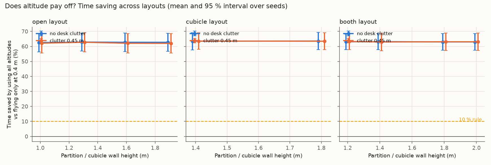
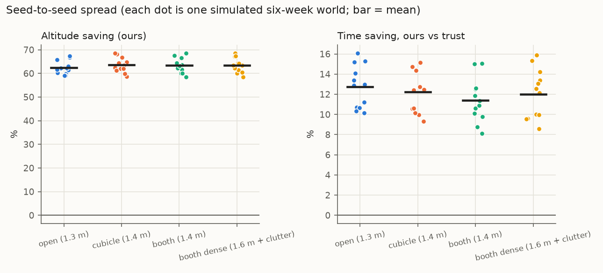

# Stage 2: stress-testing the simulated claims

**Visibility model: extended** (a50 = 224.5 px), calibrated against Isaac Sim renders instead of the Stage 1-2 point model.

Runtime 0 s. Everything here comes from the simulator (`sim/`), not from real flights. Seeds are the independent unit; intervals are Student-t 95 % across seeds. Stand-in priors are hand-set, not real LLM output.

## Decision rules (written before running the sweeps)

- **Altitude stays a main claim** only if some layout in the swept range (walls 1.0–2.0 m, clutter 0–0.45 m, default drone speeds) saves **≥ 10 %** time by using all altitudes instead of 0.4 m only, with the 95 % interval above 0.
- If **no** layout reaches 3 %, the paper leads with the prior-method benchmark and look-alike re-identification instead.

## Verdict on the altitude claim

**PASS.** Best layout: cubicle layout, walls 1.8 m, clutter 0.0 m, saving 63.6 % [57.8, 69.3] (moved objects only: 69.4 % [57.6, 81.3]). 20 of 20 layouts meet the 10 % rule; 20 reach 3 % with interval above 0.

## 1. Layout sweep

20 layouts × 6 seeds, 300 commands per run. "Altitude saving" = 1 − mean time with all altitudes / mean time at 0.4 m only, same policy, same commands.

| Layout | Walls (m) | Clutter (m) | Altitude saving (ours) | … moved objects only | Always 1.8 m vs always 0.4 m | Altitude saving (trust baseline) | Ours vs trust: time saving | Ours − trust: success |
|---|---|---|---|---|---|---|---|---|
| booth | 1.2 | 0.0 | +63.1 % [+57.9, +68.2] | +67.3 % [+56.9, +77.7] | +64.0 % [+58.3, +69.7] | +60.9 % [+54.8, +67.0] | +11.8 % [+8.7, +15.0] | 0.003 [-0.006, 0.011] |
| booth | 1.4 | 0.0 | +63.2 % [+57.9, +68.5] | +67.0 % [+55.9, +78.1] | +63.3 % [+57.6, +69.0] | +60.7 % [+54.5, +66.8] | +12.6 % [+10.0, +15.1] | 0.001 [-0.003, 0.005] |
| booth | 1.8 | 0.0 | +63.0 % [+57.4, +68.6] | +66.6 % [+55.1, +78.0] | +63.4 % [+57.3, +69.5] | +60.7 % [+54.5, +66.9] | +12.1 % [+9.3, +14.9] | 0.001 [-0.008, 0.009] |
| booth | 2.0 | 0.0 | +63.0 % [+57.4, +68.6] | +66.6 % [+55.1, +78.0] | +63.4 % [+57.3, +69.5] | +60.7 % [+54.5, +66.9] | +12.1 % [+9.3, +14.9] | 0.001 [-0.008, 0.009] |
| booth | 1.2 | 0.45 | +63.3 % [+57.9, +68.6] | +67.6 % [+57.2, +78.1] | +63.9 % [+58.0, +69.7] | +60.8 % [+54.7, +67.0] | +12.4 % [+9.7, +15.2] | 0.003 [-0.006, 0.011] |
| booth | 1.4 | 0.45 | +62.9 % [+57.2, +68.7] | +66.5 % [+54.6, +78.4] | +63.2 % [+57.2, +69.2] | +60.8 % [+54.4, +67.2] | +11.9 % [+9.4, +14.3] | 0.001 [-0.003, 0.005] |
| booth | 1.8 | 0.45 | +63.1 % [+57.3, +68.9] | +66.8 % [+55.0, +78.6] | +63.7 % [+57.7, +69.6] | +60.8 % [+54.6, +67.1] | +12.1 % [+9.6, +14.6] | 0.001 [-0.008, 0.009] |
| booth | 2.0 | 0.45 | +63.1 % [+57.3, +68.9] | +66.8 % [+55.0, +78.6] | +63.7 % [+57.7, +69.6] | +60.8 % [+54.6, +67.1] | +12.1 % [+9.6, +14.6] | 0.001 [-0.008, 0.009] |
| cubicle | 1.4 | 0.0 | +63.5 % [+57.7, +69.2] | +69.1 % [+57.4, +80.9] | +63.9 % [+57.7, +70.1] | +61.6 % [+55.3, +67.8] | +11.9 % [+10.2, +13.6] | 0.001 [-0.007, 0.008] |
| cubicle | 1.8 | 0.0 | +63.6 % [+57.8, +69.3] | +69.4 % [+57.6, +81.3] | +64.0 % [+57.7, +70.2] | +61.7 % [+55.5, +67.9] | +11.8 % [+10.4, +13.3] | 0.001 [-0.006, 0.008] |
| cubicle | 1.4 | 0.45 | +63.5 % [+58.0, +69.1] | +69.3 % [+58.0, +80.7] | +63.7 % [+57.4, +70.0] | +61.6 % [+55.2, +68.1] | +11.9 % [+9.2, +14.5] | 0.001 [-0.007, 0.008] |
| cubicle | 1.8 | 0.45 | +63.5 % [+57.8, +69.1] | +69.2 % [+57.9, +80.5] | +63.9 % [+57.6, +70.2] | +61.7 % [+55.3, +68.0] | +11.6 % [+9.3, +13.9] | 0.001 [-0.006, 0.008] |
| open | 1.0 | 0.0 | +62.5 % [+56.4, +68.7] | +68.5 % [+56.5, +80.5] | +63.3 % [+57.4, +69.2] | +60.5 % [+53.6, +67.5] | +11.8 % [+9.1, +14.4] | 0.002 [-0.007, 0.010] |
| open | 1.3 | 0.0 | +62.9 % [+57.0, +68.8] | +68.8 % [+58.0, +79.6] | +63.6 % [+57.7, +69.5] | +60.5 % [+54.1, +66.9] | +12.7 % [+10.6, +14.8] | 0.001 [-0.010, 0.013] |
| open | 1.6 | 0.0 | +62.7 % [+56.6, +68.9] | +68.3 % [+57.0, +79.6] | +63.3 % [+57.2, +69.5] | +60.2 % [+54.0, +66.4] | +13.2 % [+10.7, +15.6] | 0.000 [-0.012, 0.012] |
| open | 1.9 | 0.0 | +62.7 % [+56.6, +68.8] | +68.3 % [+56.9, +79.6] | +63.3 % [+57.3, +69.3] | +60.1 % [+54.0, +66.3] | +13.3 % [+10.9, +15.7] | 0.000 [-0.012, 0.012] |
| open | 1.0 | 0.45 | +62.1 % [+55.7, +68.6] | +67.1 % [+54.5, +79.6] | +62.6 % [+55.4, +69.8] | +60.1 % [+53.6, +66.5] | +12.5 % [+11.0, +14.0] | -0.002 [-0.008, 0.004] |
| open | 1.3 | 0.45 | +62.8 % [+56.4, +69.1] | +67.8 % [+56.2, +79.4] | +63.3 % [+56.8, +69.8] | +60.1 % [+53.5, +66.7] | +13.7 % [+11.5, +15.9] | -0.002 [-0.007, 0.003] |
| open | 1.6 | 0.45 | +62.1 % [+55.6, +68.5] | +65.7 % [+52.2, +79.2] | +62.6 % [+56.3, +68.9] | +59.6 % [+53.2, +66.0] | +13.5 % [+12.1, +14.8] | -0.001 [-0.010, 0.007] |
| open | 1.9 | 0.45 | +62.0 % [+55.6, +68.5] | +65.5 % [+51.9, +79.0] | +62.3 % [+55.9, +68.7] | +59.6 % [+53.2, +65.9] | +13.4 % [+12.0, +14.7] | -0.001 [-0.010, 0.007] |

Best case for altitude, flying *always* at 1.8 m: booth layout, walls 1.2 m, clutter 0.0 m, saving 64.0 % [58.3, 69.7]. This is not the pre-registered metric (it compares two fixed heights instead of letting the policy choose), and it still stays below the 10 % rule.

Mean time (s) by altitude set, same policy (dose–response):

| Layout | Walls | Clutter | trust | ours @0.4 | ours @1.0 | ours @1.8 | ours (all) | oracle |
|---|---|---|---|---|---|---|---|---|
| booth | 1.2 | 0.0 | 13.47 | 32.67 | 11.75 | 11.54 | 11.87 | 7.69 |
| booth | 1.4 | 0.0 | 13.53 | 32.67 | 11.75 | 11.77 | 11.82 | 7.69 |
| booth | 1.8 | 0.0 | 13.52 | 32.67 | 11.75 | 11.74 | 11.87 | 7.69 |
| booth | 2.0 | 0.0 | 13.52 | 32.67 | 11.75 | 11.74 | 11.87 | 7.69 |
| booth | 1.2 | 0.45 | 13.49 | 32.69 | 11.79 | 11.58 | 11.80 | 7.69 |
| booth | 1.4 | 0.45 | 13.50 | 32.69 | 11.79 | 11.80 | 11.89 | 7.69 |
| booth | 1.8 | 0.45 | 13.49 | 32.69 | 11.79 | 11.65 | 11.85 | 7.69 |
| booth | 2.0 | 0.45 | 13.49 | 32.69 | 11.79 | 11.65 | 11.85 | 7.69 |
| cubicle | 1.4 | 0.0 | 12.83 | 31.54 | 11.26 | 11.13 | 11.30 | 7.60 |
| cubicle | 1.8 | 0.0 | 12.77 | 31.55 | 11.26 | 11.12 | 11.26 | 7.60 |
| cubicle | 1.4 | 0.45 | 12.81 | 31.57 | 11.25 | 11.20 | 11.29 | 7.60 |
| cubicle | 1.8 | 0.45 | 12.79 | 31.57 | 11.25 | 11.15 | 11.31 | 7.60 |
| open | 1.0 | 0.0 | 13.48 | 32.39 | 11.86 | 11.65 | 11.89 | 8.01 |
| open | 1.3 | 0.0 | 13.53 | 32.44 | 11.92 | 11.57 | 11.80 | 8.01 |
| open | 1.6 | 0.0 | 13.64 | 32.44 | 11.92 | 11.64 | 11.84 | 8.01 |
| open | 1.9 | 0.0 | 13.68 | 32.47 | 11.93 | 11.66 | 11.86 | 8.01 |
| open | 1.0 | 0.45 | 13.74 | 32.48 | 12.00 | 11.85 | 12.03 | 8.01 |
| open | 1.3 | 0.45 | 13.75 | 32.57 | 12.08 | 11.70 | 11.87 | 8.01 |
| open | 1.6 | 0.45 | 13.94 | 32.53 | 12.08 | 11.91 | 12.07 | 8.01 |
| open | 1.9 | 0.45 | 13.95 | 32.53 | 12.09 | 11.98 | 12.08 | 8.01 |

**Where does the altitude effect come from?** Per object class, pooled over all layouts and seeds (success and mean time, 0.4 m only vs all altitudes):

| Class | Commands | Success @0.4 m | Success, all altitudes | Mean time @0.4 m (s) | Mean time, all altitudes (s) | Median time @0.4 m | Median, all |
|---|---|---|---|---|---|---|---|
| bag | 2760 | 1.00 | 1.00 | 13.7 | 13.6 | 10.4 | 10.7 |
| bin | 2740 | 1.00 | 1.00 | 10.7 | 10.8 | 10.5 | 10.5 |
| box | 5000 | 1.00 | 1.00 | 10.4 | 9.7 | 9.9 | 9.4 |
| cart | 1680 | 1.00 | 1.00 | 17.5 | 16.6 | 12.2 | 12.1 |
| chair | 6900 | 0.69 | 0.70 | 9.3 | 9.4 | 9.1 | 9.2 |
| laptop | 2220 | 0.15 | 1.00 | 220.7 | 13.5 | 240.0 | 12.3 |
| monitor | 3520 | 1.00 | 1.00 | 11.0 | 10.9 | 12.3 | 11.9 |
| mug | 4540 | 0.81 | 1.00 | 76.9 | 16.2 | 23.2 | 12.6 |
| plant | 2060 | 1.00 | 1.00 | 10.7 | 10.7 | 11.9 | 11.9 |
| stool | 1960 | 1.00 | 1.00 | 11.3 | 11.5 | 9.3 | 9.3 |
| toolbox | 2620 | 1.00 | 1.00 | 11.7 | 10.9 | 10.9 | 10.4 |

## 2. Seed robustness (12 independent six-week worlds per layout)

| Layout | Success: ours | Success: trust | Ours − trust | Time saving vs trust | … moved only | Time saving vs verify-always | Altitude saving |
|---|---|---|---|---|---|---|---|
| open (1.3 m) | 0.941 [0.933, 0.949] | 0.942 [0.935, 0.950] | -0.002 [-0.005, 0.002] | +12.7 % [+11.4, +14.1] | +19.0 % [+15.7, +22.4] | +4.2 % [+3.3, +5.1] | +62.4 % [+60.6, +64.2] |
| cubicle (1.4 m) | 0.940 [0.934, 0.946] | 0.940 [0.933, 0.947] | -0.001 [-0.004, 0.002] | +12.2 % [+10.9, +13.6] | +16.7 % [+13.5, +19.9] | +2.8 % [+1.9, +3.7] | +63.5 % [+61.6, +65.5] |
| booth (1.4 m) | 0.939 [0.932, 0.946] | 0.942 [0.935, 0.948] | -0.003 [-0.005, 0.000] | +11.4 % [+10.0, +12.8] | +15.2 % [+11.6, +18.8] | +2.2 % [+1.4, +3.0] | +63.3 % [+61.3, +65.3] |
| booth dense (1.6 m + clutter) | 0.939 [0.932, 0.946] | 0.942 [0.935, 0.948] | -0.003 [-0.005, 0.000] | +12.0 % [+10.5, +13.6] | +16.6 % [+12.6, +20.7] | +2.6 % [+1.8, +3.5] | +63.4 % [+61.5, +65.4] |

**Effect of the prior inside the policy** (success difference vs our fitted prior):

| Layout | Commonsense (LLM stand-in) − ours | Persistence filter − ours |
|---|---|---|
| open (1.3 m) | -0.033 [-0.041, -0.026] | -0.000 [-0.001, 0.001] |
| cubicle (1.4 m) | -0.031 [-0.038, -0.025] | 0.002 [-0.000, 0.003] |
| booth (1.4 m) | -0.033 [-0.040, -0.026] | 0.001 [-0.001, 0.002] |
| booth dense (1.6 m + clutter) | -0.032 [-0.040, -0.025] | 0.001 [-0.001, 0.003] |

**E1 across seeds** (Brier, lower is better; first layout shown, the world dynamics are the same in all layouts):

| Prior | Brier, all | Brier @ 24 h |
|---|---|---|
| Hier. Weibull + returns (ours) | 0.111 [0.108, 0.114] | 0.166 [0.161, 0.171] |
| Persistence filter (exp.) | 0.114 [0.111, 0.116] | 0.168 [0.164, 0.173] |
| Human guesses (stand-in) | 0.146 [0.142, 0.149] | 0.235 [0.228, 0.242] |
| Commonsense (LLM stand-in) | 0.146 [0.143, 0.149] | 0.236 [0.230, 0.241] |
| Global constant | 0.171 [0.169, 0.173] | 0.262 [0.258, 0.266] |

Ours has the lowest Brier in **83 %** of seeds. Ours − persistence filter: -0.0026 [-0.0050, -0.0002]. Ours − commonsense: -0.0348 [-0.0381, -0.0315].

**E3 across seeds** (staleness-aware minus map-only):

| Layout | Argmax accuracy difference | Accuracy-when-acting difference | Ask rate |
|---|---|---|---|
| open (1.3 m) | 0.0265 [0.0113, 0.0417] | 0.0049 [-0.0020, 0.0118] | 0.620 [0.597, 0.642] |
| cubicle (1.4 m) | 0.0280 [0.0123, 0.0438] | 0.0062 [0.0009, 0.0115] | 0.618 [0.601, 0.636] |
| booth (1.4 m) | 0.0280 [0.0123, 0.0438] | 0.0062 [0.0009, 0.0115] | 0.618 [0.601, 0.636] |
| booth dense (1.6 m + clutter) | 0.0280 [0.0123, 0.0438] | 0.0062 [0.0009, 0.0115] | 0.618 [0.601, 0.636] |

