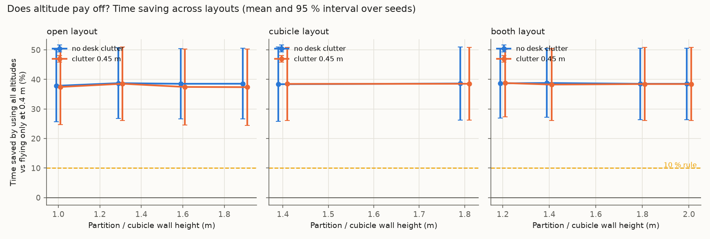

# Stage 2: stress-testing the simulated claims

**Visibility model: extended** (a50 = 224.5 px), calibrated against Isaac Sim renders instead of the Stage 1-2 point model.

Runtime 463 s. Everything here comes from the simulator (`sim/`), not from real flights. Seeds are the independent unit; intervals are Student-t 95 % across seeds. Stand-in priors are hand-set, not real LLM output.

## Decision rules (written before running the sweeps)

- **Altitude stays a main claim** only if some layout in the swept range (walls 1.0–2.0 m, clutter 0–0.45 m, default drone speeds) saves **≥ 10 %** time by using all altitudes instead of 0.4 m only, with the 95 % interval above 0.
- If **no** layout reaches 3 %, the paper leads with the prior-method benchmark and look-alike re-identification instead.

## Verdict on the altitude claim

**PASS.** Best layout: booth layout, walls 1.4 m, clutter 0.0 m, saving 38.8 % [27.2, 50.4] (moved objects only: 54.5 % [40.0, 69.0]). 20 of 20 layouts meet the 10 % rule; 20 reach 3 % with interval above 0.

## 1. Layout sweep

20 layouts × 6 seeds, 300 commands per run. "Altitude saving" = 1 − mean time with all altitudes / mean time at 0.4 m only, same policy, same commands.

| Layout | Walls (m) | Clutter (m) | Altitude saving (ours) | … moved objects only | Always 1.8 m vs always 0.4 m | Altitude saving (trust baseline) | Ours vs trust: time saving | Ours − trust: success |
|---|---|---|---|---|---|---|---|---|
| booth | 1.2 | 0.0 | +38.7 % [+26.9, +50.4] | +54.8 % [+40.0, +69.5] | +40.0 % [+27.9, +52.1] | +38.1 % [+25.8, +50.4] | +12.4 % [+9.3, +15.5] | 0.003 [-0.006, 0.011] |
| booth | 1.4 | 0.0 | +38.8 % [+27.2, +50.4] | +54.5 % [+40.0, +69.0] | +38.8 % [+26.9, +50.6] | +37.8 % [+25.2, +50.3] | +13.0 % [+10.4, +15.6] | 0.001 [-0.003, 0.005] |
| booth | 1.8 | 0.0 | +38.5 % [+26.4, +50.6] | +53.9 % [+38.9, +69.0] | +38.5 % [+25.5, +51.5] | +37.7 % [+25.4, +50.1] | +12.8 % [+9.6, +15.9] | 0.001 [-0.008, 0.009] |
| booth | 2.0 | 0.0 | +38.5 % [+26.4, +50.6] | +53.9 % [+38.9, +69.0] | +38.5 % [+25.5, +51.5] | +37.7 % [+25.4, +50.1] | +12.8 % [+9.6, +15.9] | 0.001 [-0.008, 0.009] |
| booth | 1.2 | 0.45 | +38.8 % [+27.4, +50.2] | +55.0 % [+41.1, +68.8] | +39.8 % [+28.1, +51.5] | +38.2 % [+25.9, +50.6] | +12.3 % [+9.5, +15.1] | 0.003 [-0.006, 0.011] |
| booth | 1.4 | 0.45 | +38.3 % [+26.1, +50.4] | +53.4 % [+37.6, +69.2] | +38.6 % [+26.6, +50.5] | +37.9 % [+25.5, +50.4] | +12.2 % [+9.6, +14.8] | 0.001 [-0.003, 0.005] |
| booth | 1.8 | 0.45 | +38.5 % [+26.1, +50.8] | +53.8 % [+37.5, +70.0] | +39.2 % [+26.9, +51.5] | +38.1 % [+25.8, +50.3] | +12.3 % [+9.4, +15.3] | 0.001 [-0.008, 0.009] |
| booth | 2.0 | 0.45 | +38.5 % [+26.1, +50.8] | +53.8 % [+37.5, +70.0] | +39.2 % [+26.9, +51.5] | +38.1 % [+25.8, +50.3] | +12.3 % [+9.4, +15.3] | 0.001 [-0.008, 0.009] |
| cubicle | 1.4 | 0.0 | +38.4 % [+25.8, +50.9] | +57.9 % [+44.2, +71.7] | +39.1 % [+26.3, +51.9] | +38.7 % [+26.1, +51.2] | +11.6 % [+10.0, +13.2] | 0.001 [-0.007, 0.008] |
| cubicle | 1.8 | 0.0 | +38.6 % [+26.2, +51.0] | +58.4 % [+44.9, +71.9] | +39.0 % [+26.2, +51.9] | +38.8 % [+26.4, +51.2] | +11.8 % [+10.6, +13.1] | 0.001 [-0.006, 0.008] |
| cubicle | 1.4 | 0.45 | +38.5 % [+26.1, +50.9] | +57.9 % [+44.2, +71.5] | +38.9 % [+26.1, +51.7] | +38.5 % [+26.1, +50.9] | +11.9 % [+9.2, +14.5] | 0.001 [-0.007, 0.008] |
| cubicle | 1.8 | 0.45 | +38.5 % [+26.2, +50.8] | +58.1 % [+44.9, +71.3] | +39.1 % [+26.4, +51.9] | +38.6 % [+26.3, +50.9] | +11.8 % [+9.8, +13.8] | 0.001 [-0.006, 0.008] |
| open | 1.0 | 0.0 | +37.8 % [+25.7, +50.0] | +57.2 % [+43.4, +70.9] | +39.2 % [+27.7, +50.8] | +38.3 % [+25.6, +50.9] | +11.7 % [+9.0, +14.4] | 0.002 [-0.007, 0.010] |
| open | 1.3 | 0.0 | +38.7 % [+26.8, +50.7] | +57.9 % [+44.5, +71.3] | +39.8 % [+28.2, +51.4] | +38.2 % [+26.5, +50.0] | +13.1 % [+10.9, +15.4] | 0.001 [-0.010, 0.013] |
| open | 1.6 | 0.0 | +38.5 % [+26.6, +50.5] | +57.1 % [+43.2, +71.0] | +39.1 % [+27.5, +50.8] | +37.9 % [+26.3, +49.5] | +13.5 % [+10.6, +16.4] | 0.000 [-0.012, 0.012] |
| open | 1.9 | 0.0 | +38.6 % [+26.6, +50.5] | +57.1 % [+43.1, +71.0] | +39.2 % [+27.6, +50.8] | +37.8 % [+26.1, +49.4] | +13.5 % [+10.6, +16.4] | 0.000 [-0.012, 0.012] |
| open | 1.0 | 0.45 | +37.5 % [+24.7, +50.2] | +55.1 % [+40.1, +70.2] | +38.3 % [+24.4, +52.2] | +37.9 % [+26.5, +49.4] | +12.3 % [+10.4, +14.2] | -0.002 [-0.008, 0.004] |
| open | 1.3 | 0.45 | +38.6 % [+26.1, +51.0] | +56.0 % [+41.4, +70.5] | +39.4 % [+26.7, +52.2] | +38.0 % [+26.1, +49.8] | +13.5 % [+10.8, +16.2] | -0.002 [-0.007, 0.003] |
| open | 1.6 | 0.45 | +37.5 % [+24.6, +50.3] | +53.6 % [+37.9, +69.2] | +38.2 % [+25.8, +50.6] | +37.0 % [+25.0, +49.0] | +13.6 % [+12.3, +14.9] | -0.001 [-0.010, 0.007] |
| open | 1.9 | 0.45 | +37.4 % [+24.5, +50.3] | +53.2 % [+37.2, +69.3] | +37.7 % [+25.3, +50.2] | +37.0 % [+25.0, +49.0] | +13.5 % [+12.3, +14.7] | -0.001 [-0.010, 0.007] |

Best case for altitude, flying *always* at 1.8 m: booth layout, walls 1.2 m, clutter 0.0 m, saving 40.0 % [27.9, 52.1]. This is not the pre-registered metric (it compares two fixed heights instead of letting the policy choose), and it still stays below the 10 % rule.

Mean time (s) by altitude set, same policy (dose–response):

| Layout | Walls | Clutter | trust | ours @0.4 | ours @1.0 | ours @1.8 | ours (all) | oracle |
|---|---|---|---|---|---|---|---|---|
| booth | 1.2 | 0.0 | 13.41 | 19.66 | 11.70 | 11.48 | 11.74 | 7.69 |
| booth | 1.4 | 0.0 | 13.49 | 19.66 | 11.70 | 11.72 | 11.72 | 7.69 |
| booth | 1.8 | 0.0 | 13.50 | 19.66 | 11.70 | 11.75 | 11.76 | 7.69 |
| booth | 2.0 | 0.0 | 13.50 | 19.66 | 11.70 | 11.75 | 11.76 | 7.69 |
| booth | 1.2 | 0.45 | 13.42 | 19.70 | 11.75 | 11.55 | 11.76 | 7.69 |
| booth | 1.4 | 0.45 | 13.48 | 19.70 | 11.75 | 11.78 | 11.84 | 7.69 |
| booth | 1.8 | 0.45 | 13.46 | 19.70 | 11.75 | 11.66 | 11.80 | 7.69 |
| booth | 2.0 | 0.45 | 13.46 | 19.70 | 11.75 | 11.66 | 11.80 | 7.69 |
| cubicle | 1.4 | 0.0 | 12.70 | 18.80 | 11.16 | 11.08 | 11.22 | 7.60 |
| cubicle | 1.8 | 0.0 | 12.69 | 18.80 | 11.16 | 11.09 | 11.18 | 7.60 |
| cubicle | 1.4 | 0.45 | 12.76 | 18.85 | 11.21 | 11.15 | 11.24 | 7.60 |
| cubicle | 1.8 | 0.45 | 12.74 | 18.85 | 11.21 | 11.11 | 11.23 | 7.60 |
| open | 1.0 | 0.0 | 13.43 | 19.58 | 11.79 | 11.60 | 11.85 | 8.01 |
| open | 1.3 | 0.0 | 13.48 | 19.63 | 11.84 | 11.51 | 11.71 | 8.01 |
| open | 1.6 | 0.0 | 13.58 | 19.63 | 11.84 | 11.64 | 11.75 | 8.01 |
| open | 1.9 | 0.0 | 13.61 | 19.66 | 11.85 | 11.65 | 11.76 | 8.01 |
| open | 1.0 | 0.45 | 13.68 | 19.74 | 11.94 | 11.79 | 11.99 | 8.01 |
| open | 1.3 | 0.45 | 13.69 | 19.84 | 12.02 | 11.66 | 11.84 | 8.01 |
| open | 1.6 | 0.45 | 13.91 | 19.79 | 12.02 | 11.87 | 12.01 | 8.01 |
| open | 1.9 | 0.45 | 13.90 | 19.79 | 12.03 | 11.97 | 12.03 | 8.01 |

**Where does the altitude effect come from?** Per object class, pooled over all layouts and seeds (success and mean time, 0.4 m only vs all altitudes):

| Class | Commands | Success @0.4 m | Success, all altitudes | Mean time @0.4 m (s) | Mean time, all altitudes (s) | Median time @0.4 m | Median, all |
|---|---|---|---|---|---|---|---|
| bag | 2760 | 1.00 | 1.00 | 13.7 | 13.6 | 10.4 | 10.7 |
| bin | 2740 | 1.00 | 1.00 | 10.7 | 10.8 | 10.5 | 10.5 |
| box | 5000 | 1.00 | 1.00 | 10.4 | 9.7 | 9.9 | 9.4 |
| cart | 1680 | 1.00 | 1.00 | 17.5 | 16.6 | 12.2 | 12.1 |
| chair | 6900 | 0.69 | 0.70 | 9.3 | 9.4 | 9.1 | 9.2 |
| laptop | 2220 | 1.00 | 1.00 | 12.3 | 12.3 | 11.5 | 11.5 |
| monitor | 3520 | 1.00 | 1.00 | 11.0 | 10.9 | 12.3 | 11.9 |
| mug | 4540 | 0.81 | 1.00 | 76.9 | 16.2 | 23.2 | 12.6 |
| plant | 2060 | 1.00 | 1.00 | 10.7 | 10.7 | 11.9 | 11.9 |
| stool | 1960 | 1.00 | 1.00 | 11.3 | 11.5 | 9.3 | 9.3 |
| toolbox | 2620 | 1.00 | 1.00 | 11.7 | 10.9 | 10.9 | 10.4 |

