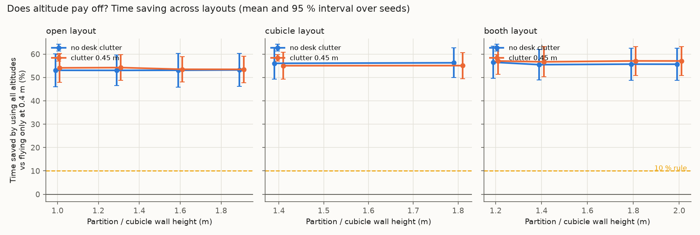
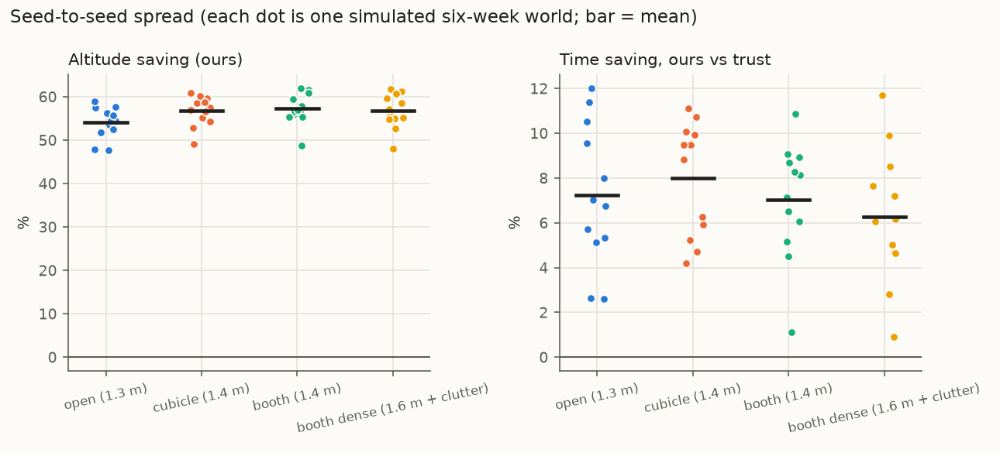
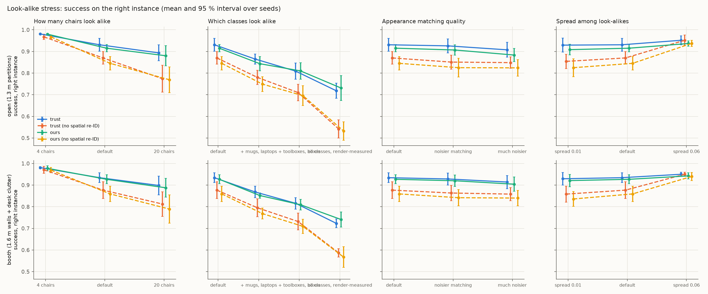

# Stage 2: stress-testing the simulated claims

**Persistent misses:** a detection miss from a viewpoint repeats on later looks from it in the same episode, and the search does not revisit viewpoints.

**Detection model: fitted to a real detector** (YOLO-World on Isaac Sim renders, per size group and viewing angle; coefficients (('flat', -14.245612026983604, 1.789378792265246, -0.1445661836422109), ('medium', -2.8776800310331976, 0.4141754013338501, -0.5277167066837809), ('small', -5.069412523202033, 0.9393253131881713, 0.15471477910180043), ('tall', -2.4756574851437114, 0.5169188150910964, -0.6266014809999095))).

**Visibility model: extended** (a50 = None px, slope 0.35, p_max 0.95), calibrated against Isaac Sim renders instead of the Stage 1-2 point model.

Runtime 1059 s. Everything here comes from the simulator (`sim/`), not from real flights. Seeds are the independent unit; intervals are Student-t 95 % across seeds. Stand-in priors are hand-set, not real LLM output.

## Decision rules (written before running the sweeps)

- **Altitude stays a main claim** only if some layout in the swept range (walls 1.0–2.0 m, clutter 0–0.45 m, default drone speeds) saves **≥ 10 %** time by using all altitudes instead of 0.4 m only, with the 95 % interval above 0.
- If **no** layout reaches 3 %, the paper leads with the prior-method benchmark and look-alike re-identification instead.

## Verdict on the altitude claim

**PASS.** Best layout: booth layout, walls 1.8 m, clutter 0.45 m, saving 57.1 % [50.9, 63.3] (moved objects only: 50.8 % [33.1, 68.4]). 20 of 20 layouts meet the 10 % rule; 20 reach 3 % with interval above 0.

## 1. Layout sweep

20 layouts × 6 seeds, 300 commands per run. "Altitude saving" = 1 − mean time with all altitudes / mean time at 0.4 m only, same policy, same commands.

| Layout | Walls (m) | Clutter (m) | Altitude saving (ours) | … moved objects only | Always 1.8 m vs always 0.4 m | Altitude saving (trust baseline) | Ours vs trust: time saving | Ours − trust: success |
|---|---|---|---|---|---|---|---|---|
| booth | 1.2 | 0.0 | +56.5 % [+49.6, +63.4] | +52.0 % [+35.6, +68.5] | +54.4 % [+47.4, +61.4] | +57.1 % [+51.8, +62.3] | +6.9 % [+4.6, +9.3] | -0.008 [-0.015, -0.001] |
| booth | 1.4 | 0.0 | +55.5 % [+48.9, +62.1] | +48.6 % [+31.1, +66.1] | +52.8 % [+45.4, +60.1] | +56.5 % [+51.4, +61.5] | +6.0 % [+1.6, +10.4] | -0.009 [-0.018, -0.001] |
| booth | 1.8 | 0.0 | +55.7 % [+48.8, +62.6] | +49.1 % [+31.2, +67.1] | +45.5 % [+33.0, +58.0] | +56.6 % [+51.6, +61.6] | +6.3 % [+2.3, +10.3] | -0.009 [-0.018, 0.000] |
| booth | 2.0 | 0.0 | +55.7 % [+48.7, +62.6] | +49.0 % [+31.1, +67.0] | +45.5 % [+33.0, +58.0] | +56.6 % [+51.5, +61.6] | +6.3 % [+2.3, +10.2] | -0.009 [-0.018, 0.000] |
| booth | 1.2 | 0.45 | +57.1 % [+51.3, +62.8] | +50.6 % [+33.0, +68.1] | +55.5 % [+48.9, +62.2] | +57.0 % [+51.8, +62.2] | +6.6 % [+2.3, +11.0] | -0.008 [-0.016, -0.001] |
| booth | 1.4 | 0.45 | +56.7 % [+50.2, +63.2] | +49.5 % [+31.3, +67.7] | +54.2 % [+46.8, +61.7] | +56.7 % [+51.5, +61.9] | +6.6 % [+1.1, +12.1] | -0.009 [-0.018, -0.001] |
| booth | 1.8 | 0.45 | +57.1 % [+50.9, +63.3] | +50.8 % [+33.1, +68.4] | +47.0 % [+33.9, +60.2] | +57.0 % [+52.2, +61.7] | +6.9 % [+1.7, +12.1] | -0.008 [-0.017, 0.001] |
| booth | 2.0 | 0.45 | +57.1 % [+50.9, +63.3] | +50.7 % [+33.1, +68.3] | +47.0 % [+33.9, +60.1] | +56.9 % [+52.1, +61.8] | +6.9 % [+1.7, +12.1] | -0.008 [-0.017, 0.001] |
| cubicle | 1.4 | 0.0 | +56.1 % [+49.3, +62.8] | +52.1 % [+42.6, +61.7] | +53.8 % [+48.2, +59.3] | +55.5 % [+49.3, +61.7] | +7.6 % [+5.9, +9.3] | -0.001 [-0.015, 0.013] |
| cubicle | 1.8 | 0.0 | +56.3 % [+49.9, +62.6] | +52.7 % [+43.7, +61.7] | +53.4 % [+46.7, +60.1] | +55.4 % [+49.1, +61.6] | +8.2 % [+7.1, +9.3] | -0.001 [-0.015, 0.013] |
| cubicle | 1.4 | 0.45 | +55.0 % [+49.3, +60.8] | +48.8 % [+36.9, +60.6] | +52.4 % [+45.9, +58.9] | +55.0 % [+49.2, +60.8] | +7.5 % [+6.1, +8.8] | -0.002 [-0.017, 0.012] |
| cubicle | 1.8 | 0.45 | +55.1 % [+49.4, +60.7] | +48.9 % [+37.0, +60.7] | +52.2 % [+45.9, +58.5] | +55.1 % [+49.3, +60.8] | +7.4 % [+6.0, +8.8] | -0.002 [-0.017, 0.012] |
| open | 1.0 | 0.0 | +53.1 % [+46.0, +60.1] | +47.1 % [+29.8, +64.5] | +52.2 % [+44.3, +60.2] | +52.5 % [+47.4, +57.7] | +8.1 % [+3.6, +12.5] | -0.008 [-0.020, 0.004] |
| open | 1.3 | 0.0 | +53.0 % [+46.6, +59.5] | +46.5 % [+29.5, +63.5] | +52.2 % [+44.5, +60.0] | +52.7 % [+47.7, +57.7] | +7.6 % [+3.5, +11.6] | -0.003 [-0.018, 0.012] |
| open | 1.6 | 0.0 | +53.1 % [+45.9, +60.3] | +46.6 % [+28.7, +64.4] | +48.8 % [+39.6, +57.9] | +53.2 % [+47.9, +58.4] | +7.0 % [+3.3, +10.6] | -0.006 [-0.021, 0.010] |
| open | 1.9 | 0.0 | +53.2 % [+46.2, +60.3] | +47.0 % [+29.8, +64.2] | +48.9 % [+39.3, +58.6] | +53.1 % [+48.3, +58.0] | +7.3 % [+3.4, +11.2] | -0.006 [-0.021, 0.010] |
| open | 1.0 | 0.45 | +54.1 % [+47.9, +60.3] | +49.5 % [+36.8, +62.2] | +51.8 % [+42.9, +60.6] | +53.6 % [+48.8, +58.3] | +8.8 % [+3.4, +14.2] | -0.009 [-0.023, 0.004] |
| open | 1.3 | 0.45 | +54.2 % [+48.7, +59.8] | +50.1 % [+37.7, +62.5] | +50.6 % [+41.3, +59.9] | +52.6 % [+48.3, +56.9] | +10.8 % [+6.0, +15.7] | -0.007 [-0.017, 0.004] |
| open | 1.6 | 0.45 | +53.5 % [+48.1, +58.9] | +47.7 % [+35.3, +60.1] | +48.6 % [+39.4, +57.9] | +52.6 % [+47.4, +57.8] | +9.2 % [+3.3, +15.1] | -0.008 [-0.021, 0.006] |
| open | 1.9 | 0.45 | +53.5 % [+47.8, +59.1] | +48.0 % [+37.0, +59.0] | +48.6 % [+38.3, +58.8] | +52.3 % [+47.6, +57.1] | +9.6 % [+4.6, +14.5] | -0.007 [-0.021, 0.006] |

Best case for altitude, flying *always* at 1.8 m: booth layout, walls 1.2 m, clutter 0.45 m, saving 55.5 % [48.9, 62.2]. This is not the pre-registered metric (it compares two fixed heights instead of letting the policy choose), and it still stays below the 10 % rule.

Mean time (s) by altitude set, same policy (dose–response):

| Layout | Walls | Clutter | trust | ours @0.4 | ours @1.0 | ours @1.8 | ours (all) | oracle |
|---|---|---|---|---|---|---|---|---|
| booth | 1.2 | 0.0 | 14.89 | 32.53 | 14.07 | 14.54 | 13.85 | 7.69 |
| booth | 1.4 | 0.0 | 15.12 | 32.52 | 14.09 | 15.04 | 14.21 | 7.69 |
| booth | 1.8 | 0.0 | 15.06 | 32.52 | 14.03 | 17.24 | 14.11 | 7.69 |
| booth | 2.0 | 0.0 | 15.07 | 32.52 | 14.03 | 17.24 | 14.12 | 7.69 |
| booth | 1.2 | 0.45 | 15.13 | 33.39 | 13.91 | 14.59 | 14.12 | 7.69 |
| booth | 1.4 | 0.45 | 15.22 | 33.38 | 13.95 | 14.99 | 14.20 | 7.69 |
| booth | 1.8 | 0.45 | 15.14 | 33.38 | 13.96 | 17.19 | 14.08 | 7.69 |
| booth | 2.0 | 0.45 | 15.15 | 33.38 | 13.96 | 17.19 | 14.09 | 7.69 |
| cubicle | 1.4 | 0.0 | 14.26 | 30.47 | 13.45 | 13.90 | 13.17 | 7.60 |
| cubicle | 1.8 | 0.0 | 14.29 | 30.48 | 13.42 | 13.97 | 13.12 | 7.60 |
| cubicle | 1.4 | 0.45 | 14.35 | 29.94 | 13.55 | 14.02 | 13.27 | 7.60 |
| cubicle | 1.8 | 0.45 | 14.33 | 29.94 | 13.55 | 14.09 | 13.26 | 7.60 |
| open | 1.0 | 0.0 | 15.40 | 30.74 | 14.16 | 14.35 | 14.15 | 8.01 |
| open | 1.3 | 0.0 | 15.35 | 30.76 | 14.19 | 14.38 | 14.19 | 8.01 |
| open | 1.6 | 0.0 | 15.20 | 30.74 | 14.14 | 15.42 | 14.13 | 8.01 |
| open | 1.9 | 0.0 | 15.24 | 30.76 | 14.12 | 15.38 | 14.11 | 8.01 |
| open | 1.0 | 0.45 | 15.43 | 31.15 | 14.48 | 14.67 | 14.05 | 8.01 |
| open | 1.3 | 0.45 | 15.76 | 31.15 | 14.63 | 15.01 | 14.04 | 8.01 |
| open | 1.6 | 0.45 | 15.73 | 31.15 | 14.56 | 15.66 | 14.27 | 8.01 |
| open | 1.9 | 0.45 | 15.84 | 31.24 | 14.58 | 15.73 | 14.32 | 8.01 |

**Where does the altitude effect come from?** Per object class, pooled over all layouts and seeds (success and mean time, 0.4 m only vs all altitudes):

| Class | Commands | Success @0.4 m | Success, all altitudes | Mean time @0.4 m (s) | Mean time, all altitudes (s) | Median time @0.4 m | Median, all |
|---|---|---|---|---|---|---|---|
| bag | 2760 | 1.00 | 1.00 | 17.1 | 18.4 | 11.2 | 11.9 |
| bin | 2740 | 1.00 | 1.00 | 12.5 | 13.6 | 10.6 | 12.8 |
| box | 5000 | 0.99 | 1.00 | 14.2 | 11.8 | 10.9 | 10.9 |
| cart | 1680 | 1.00 | 1.00 | 18.1 | 18.2 | 12.1 | 12.6 |
| chair | 6900 | 0.67 | 0.66 | 9.3 | 9.4 | 9.1 | 9.2 |
| laptop | 2220 | 0.00 | 1.00 | 239.4 | 21.3 | 240.0 | 12.7 |
| monitor | 3520 | 1.00 | 1.00 | 12.9 | 11.4 | 12.4 | 11.9 |
| mug | 4540 | 0.92 | 1.00 | 43.1 | 16.8 | 15.9 | 12.6 |
| plant | 2060 | 1.00 | 1.00 | 12.1 | 13.3 | 11.9 | 13.7 |
| stool | 1960 | 1.00 | 1.00 | 15.7 | 16.9 | 10.9 | 12.2 |
| toolbox | 2620 | 0.95 | 1.00 | 24.0 | 13.5 | 11.9 | 10.9 |

## 2. Seed robustness (12 independent six-week worlds per layout)

| Layout | Success: ours | Success: trust | Ours − trust | Time saving vs trust | … moved only | Time saving vs verify-always | Altitude saving |
|---|---|---|---|---|---|---|---|
| open (1.3 m) | 0.932 [0.923, 0.941] | 0.941 [0.933, 0.948] | -0.008 [-0.012, -0.005] | +7.2 % [+5.2, +9.2] | +9.5 % [+5.6, +13.4] | +1.9 % [+0.1, +3.8] | +54.0 % [+51.7, +56.3] |
| cubicle (1.4 m) | 0.934 [0.927, 0.941] | 0.938 [0.931, 0.946] | -0.004 [-0.007, -0.001] | +8.0 % [+6.4, +9.6] | +9.4 % [+5.5, +13.4] | +2.2 % [+0.5, +3.9] | +56.7 % [+54.6, +58.9] |
| booth (1.4 m) | 0.934 [0.926, 0.942] | 0.941 [0.934, 0.947] | -0.007 [-0.012, -0.002] | +7.0 % [+5.4, +8.7] | +9.0 % [+4.8, +13.1] | +1.7 % [-0.3, +3.7] | +57.3 % [+55.0, +59.6] |
| booth dense (1.6 m + clutter) | 0.934 [0.927, 0.942] | 0.941 [0.934, 0.947] | -0.006 [-0.011, -0.002] | +6.3 % [+4.4, +8.2] | +5.9 % [+1.2, +10.6] | +1.3 % [-1.2, +3.8] | +56.7 % [+54.2, +59.2] |

**Effect of the prior inside the policy** (success difference vs our fitted prior):

| Layout | Commonsense (LLM stand-in) − ours | Persistence filter − ours |
|---|---|---|
| open (1.3 m) | -0.029 [-0.036, -0.022] | 0.003 [-0.001, 0.007] |
| cubicle (1.4 m) | -0.030 [-0.036, -0.024] | 0.005 [0.002, 0.007] |
| booth (1.4 m) | -0.031 [-0.037, -0.026] | 0.004 [0.000, 0.007] |
| booth dense (1.6 m + clutter) | -0.032 [-0.038, -0.026] | 0.003 [-0.000, 0.006] |

**E1 across seeds** (Brier, lower is better; first layout shown, the world dynamics are the same in all layouts):

| Prior | Brier, all | Brier @ 24 h |
|---|---|---|
| Hier. Weibull + returns (ours) | 0.111 [0.108, 0.114] | 0.166 [0.161, 0.171] |
| Persistence filter (exp.) | 0.114 [0.111, 0.116] | 0.168 [0.164, 0.173] |
| Human guesses (stand-in) | 0.146 [0.142, 0.149] | 0.235 [0.228, 0.242] |
| Commonsense (LLM stand-in) | 0.146 [0.143, 0.149] | 0.236 [0.230, 0.241] |
| Global constant | 0.171 [0.169, 0.173] | 0.262 [0.258, 0.266] |

Ours has the lowest Brier in **83 %** of seeds. Ours − persistence filter: -0.0026 [-0.0050, -0.0002]. Ours − commonsense: -0.0348 [-0.0381, -0.0315].

**E3 across seeds** (staleness-aware minus map-only):

| Layout | Argmax accuracy difference | Accuracy-when-acting difference | Ask rate |
|---|---|---|---|
| open (1.3 m) | 0.0265 [0.0113, 0.0417] | 0.0049 [-0.0020, 0.0118] | 0.620 [0.597, 0.642] |
| cubicle (1.4 m) | 0.0280 [0.0123, 0.0438] | 0.0062 [0.0009, 0.0115] | 0.618 [0.601, 0.636] |
| booth (1.4 m) | 0.0280 [0.0123, 0.0438] | 0.0062 [0.0009, 0.0115] | 0.618 [0.601, 0.636] |
| booth dense (1.6 m + clutter) | 0.0280 [0.0123, 0.0438] | 0.0062 [0.0009, 0.0115] | 0.618 [0.601, 0.636] |

## 4. Look-alike stress

Success = the commanded *instance* reached. "No spatial re-ID" ignores where the belief says the object probably is when choosing between look-alikes. Failure share = fraction of the policy's failures that involve a look-alike class.

**open (1.3 m partitions)**

| Setting | trust | trust, no spatial | ours | ours, no spatial | Spatial prior gain (ours) | Intent success (ours) | Failures on look-alikes |
|---|---|---|---|---|---|---|---|
| default (12 chairs) | 0.931 [0.901, 0.961] | 0.870 [0.841, 0.899] | 0.915 [0.899, 0.931] | 0.845 [0.814, 0.876] | 0.070 [0.029, 0.111] | 1.000 [1.000, 1.000] | 100.0 % [100.0, 100.0] |
| 4 chairs | 0.981 [0.978, 0.983] | 0.968 [0.956, 0.979] | 0.980 [0.976, 0.984] | 0.968 [0.960, 0.975] | 0.013 [0.003, 0.022] | 1.000 [1.000, 1.000] | 100.0 % [100.0, 100.0] |
| 20 chairs | 0.893 [0.856, 0.930] | 0.774 [0.712, 0.836] | 0.880 [0.834, 0.926] | 0.769 [0.710, 0.828] | 0.111 [0.079, 0.143] | 1.000 [1.000, 1.000] | 100.0 % [100.0, 100.0] |
| + mugs, laptops | 0.865 [0.841, 0.889] | 0.780 [0.747, 0.813] | 0.843 [0.810, 0.877] | 0.749 [0.715, 0.783] | 0.094 [0.068, 0.121] | 1.000 [1.000, 1.000] | 100.0 % [100.0, 100.0] |
| + toolboxes, boxes | 0.809 [0.772, 0.847] | 0.710 [0.672, 0.748] | 0.810 [0.772, 0.848] | 0.696 [0.650, 0.742] | 0.114 [0.083, 0.145] | 1.000 [1.000, 1.000] | 100.0 % [100.0, 100.0] |
| all classes, render-measured | 0.718 [0.684, 0.753] | 0.542 [0.500, 0.584] | 0.731 [0.673, 0.789] | 0.532 [0.490, 0.575] | 0.198 [0.148, 0.249] | 1.000 [1.000, 1.000] | 100.0 % [100.0, 100.0] |
| noisier matching | 0.926 [0.894, 0.958] | 0.851 [0.818, 0.883] | 0.907 [0.883, 0.931] | 0.825 [0.781, 0.869] | 0.082 [0.038, 0.126] | 1.000 [1.000, 1.000] | 100.0 % [100.0, 100.0] |
| much noisier | 0.907 [0.873, 0.942] | 0.848 [0.822, 0.875] | 0.883 [0.853, 0.914] | 0.824 [0.786, 0.863] | 0.059 [0.035, 0.083] | 1.000 [1.000, 1.000] | 100.0 % [100.0, 100.0] |
| spread 0.01 | 0.929 [0.897, 0.962] | 0.854 [0.821, 0.887] | 0.908 [0.884, 0.933] | 0.825 [0.783, 0.867] | 0.083 [0.040, 0.127] | 1.000 [1.000, 1.000] | 100.0 % [100.0, 100.0] |
| spread 0.06 | 0.952 [0.931, 0.972] | 0.952 [0.928, 0.976] | 0.937 [0.924, 0.949] | 0.938 [0.924, 0.951] | -0.001 [-0.003, 0.002] | 1.000 [1.000, 1.000] | 100.0 % [100.0, 100.0] |

**booth (1.6 m walls + desk clutter)**

| Setting | trust | trust, no spatial | ours | ours, no spatial | Spatial prior gain (ours) | Intent success (ours) | Failures on look-alikes |
|---|---|---|---|---|---|---|---|
| default (12 chairs) | 0.934 [0.911, 0.957] | 0.877 [0.837, 0.916] | 0.927 [0.906, 0.947] | 0.859 [0.824, 0.895] | 0.067 [0.040, 0.095] | 1.000 [1.000, 1.000] | 100.0 % [100.0, 100.0] |
| 4 chairs | 0.981 [0.976, 0.986] | 0.971 [0.954, 0.987] | 0.978 [0.966, 0.989] | 0.969 [0.957, 0.981] | 0.008 [0.001, 0.015] | 0.999 [0.997, 1.002] | 96.9 % [86.9, 106.8] |
| 20 chairs | 0.898 [0.855, 0.941] | 0.812 [0.756, 0.869] | 0.887 [0.844, 0.931] | 0.789 [0.724, 0.854] | 0.098 [0.068, 0.129] | 1.000 [1.000, 1.000] | 100.0 % [100.0, 100.0] |
| + mugs, laptops | 0.868 [0.842, 0.895] | 0.795 [0.753, 0.837] | 0.852 [0.839, 0.864] | 0.768 [0.743, 0.793] | 0.083 [0.055, 0.112] | 1.000 [1.000, 1.000] | 100.0 % [100.0, 100.0] |
| + toolboxes, boxes | 0.816 [0.789, 0.842] | 0.732 [0.693, 0.771] | 0.809 [0.785, 0.833] | 0.709 [0.676, 0.743] | 0.100 [0.067, 0.133] | 1.000 [1.000, 1.000] | 100.0 % [100.0, 100.0] |
| all classes, render-measured | 0.723 [0.703, 0.743] | 0.587 [0.567, 0.607] | 0.741 [0.706, 0.776] | 0.568 [0.520, 0.615] | 0.173 [0.125, 0.221] | 1.000 [1.000, 1.000] | 100.0 % [100.0, 100.0] |
| noisier matching | 0.928 [0.900, 0.956] | 0.863 [0.828, 0.899] | 0.920 [0.893, 0.947] | 0.842 [0.805, 0.879] | 0.078 [0.047, 0.110] | 1.000 [1.000, 1.000] | 100.0 % [100.0, 100.0] |
| much noisier | 0.914 [0.884, 0.945] | 0.858 [0.828, 0.889] | 0.904 [0.871, 0.937] | 0.840 [0.805, 0.875] | 0.064 [0.044, 0.085] | 1.000 [1.000, 1.000] | 100.0 % [100.0, 100.0] |
| spread 0.01 | 0.929 [0.900, 0.958] | 0.858 [0.821, 0.895] | 0.921 [0.892, 0.950] | 0.836 [0.802, 0.870] | 0.085 [0.058, 0.112] | 1.000 [1.000, 1.000] | 100.0 % [100.0, 100.0] |
| spread 0.06 | 0.950 [0.940, 0.960] | 0.950 [0.940, 0.960] | 0.942 [0.929, 0.956] | 0.940 [0.921, 0.959] | 0.003 [-0.005, 0.010] | 1.000 [1.000, 1.000] | 100.0 % [100.0, 100.0] |

