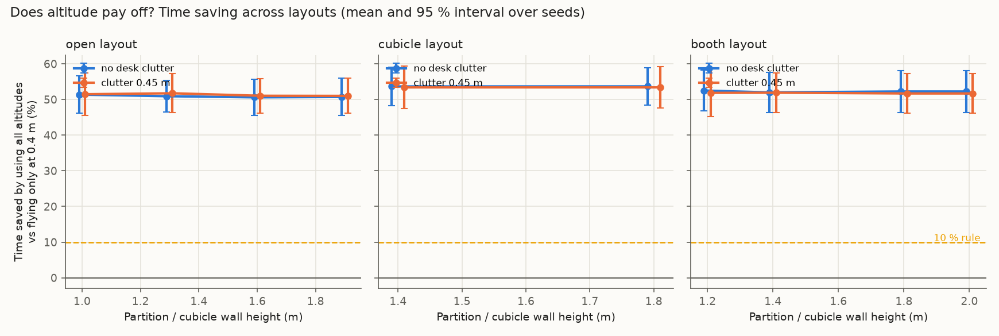
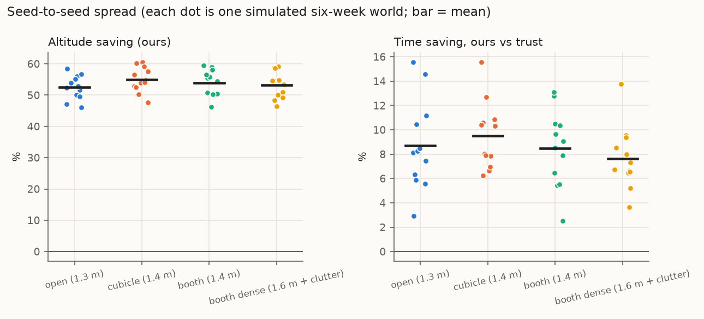
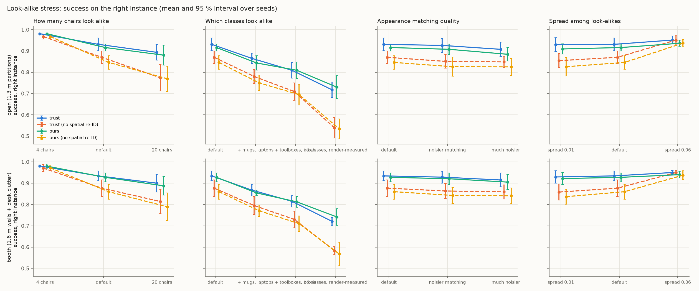

# Stage 2: stress-testing the simulated claims

**Detection model: fitted to a real detector** (YOLO-World on Isaac Sim renders, per size group and viewing angle; coefficients (('flat', -14.245612026983604, 1.789378792265246, -0.1445661836422109), ('medium', -2.8776800310331976, 0.4141754013338501, -0.5277167066837809), ('small', -5.069412523202033, 0.9393253131881713, 0.15471477910180043), ('tall', -2.4756574851437114, 0.5169188150910964, -0.6266014809999095))).

**Visibility model: extended** (a50 = None px, slope 0.35, p_max 0.95), calibrated against Isaac Sim renders instead of the Stage 1-2 point model.

Runtime 1074 s. Everything here comes from the simulator (`sim/`), not from real flights. Seeds are the independent unit; intervals are Student-t 95 % across seeds. Stand-in priors are hand-set, not real LLM output.

## Decision rules (written before running the sweeps)

- **Altitude stays a main claim** only if some layout in the swept range (walls 1.0–2.0 m, clutter 0–0.45 m, default drone speeds) saves **≥ 10 %** time by using all altitudes instead of 0.4 m only, with the 95 % interval above 0.
- If **no** layout reaches 3 %, the paper leads with the prior-method benchmark and look-alike re-identification instead.

## Verdict on the altitude claim

**PASS.** Best layout: cubicle layout, walls 1.8 m, clutter 0.0 m, saving 53.7 % [48.4, 58.9] (moved objects only: 50.2 % [33.7, 66.7]). 20 of 20 layouts meet the 10 % rule; 20 reach 3 % with interval above 0.

## 1. Layout sweep

20 layouts × 6 seeds, 300 commands per run. "Altitude saving" = 1 − mean time with all altitudes / mean time at 0.4 m only, same policy, same commands.

| Layout | Walls (m) | Clutter (m) | Altitude saving (ours) | … moved objects only | Always 1.8 m vs always 0.4 m | Altitude saving (trust baseline) | Ours vs trust: time saving | Ours − trust: success |
|---|---|---|---|---|---|---|---|---|
| booth | 1.2 | 0.0 | +52.5 % [+46.8, +58.3] | +47.9 % [+33.2, +62.6] | +50.7 % [+44.7, +56.6] | +51.7 % [+47.2, +56.2] | +9.8 % [+7.7, +11.9] | -0.008 [-0.015, -0.001] |
| booth | 1.4 | 0.0 | +52.0 % [+46.4, +57.6] | +47.2 % [+34.5, +59.9] | +49.3 % [+43.6, +55.1] | +52.3 % [+48.1, +56.5] | +7.4 % [+5.0, +9.8] | -0.008 [-0.017, -0.000] |
| booth | 1.8 | 0.0 | +52.3 % [+46.4, +58.1] | +48.0 % [+35.7, +60.3] | +49.2 % [+43.6, +54.7] | +52.3 % [+48.1, +56.6] | +8.0 % [+5.6, +10.3] | -0.008 [-0.017, 0.001] |
| booth | 2.0 | 0.0 | +52.3 % [+46.4, +58.1] | +48.0 % [+35.7, +60.3] | +49.1 % [+43.5, +54.7] | +52.3 % [+48.0, +56.6] | +8.0 % [+5.6, +10.5] | -0.008 [-0.017, 0.001] |
| booth | 1.2 | 0.45 | +51.9 % [+45.2, +58.5] | +45.7 % [+29.1, +62.3] | +51.1 % [+45.5, +56.7] | +51.1 % [+45.6, +56.5] | +9.3 % [+6.5, +12.1] | -0.008 [-0.015, -0.001] |
| booth | 1.4 | 0.45 | +51.9 % [+46.4, +57.4] | +46.9 % [+34.8, +58.9] | +49.5 % [+43.9, +55.1] | +51.7 % [+47.2, +56.2] | +8.1 % [+4.9, +11.3] | -0.008 [-0.017, -0.000] |
| booth | 1.8 | 0.45 | +51.7 % [+46.1, +57.3] | +46.1 % [+34.1, +58.1] | +49.3 % [+43.9, +54.6] | +51.7 % [+47.3, +56.2] | +7.6 % [+4.5, +10.6] | -0.008 [-0.017, 0.001] |
| booth | 2.0 | 0.45 | +51.7 % [+46.1, +57.3] | +46.1 % [+34.1, +58.1] | +49.3 % [+43.9, +54.6] | +51.7 % [+47.1, +56.3] | +7.6 % [+4.5, +10.8] | -0.008 [-0.017, 0.001] |
| cubicle | 1.4 | 0.0 | +53.7 % [+48.2, +59.1] | +49.9 % [+31.8, +68.0] | +51.4 % [+45.3, +57.6] | +52.9 % [+47.5, +58.2] | +7.9 % [+7.0, +8.8] | -0.001 [-0.015, 0.013] |
| cubicle | 1.8 | 0.0 | +53.7 % [+48.4, +58.9] | +50.2 % [+33.7, +66.7] | +51.1 % [+45.4, +56.8] | +52.8 % [+47.6, +58.1] | +8.0 % [+7.5, +8.6] | -0.001 [-0.015, 0.013] |
| cubicle | 1.4 | 0.45 | +53.4 % [+47.4, +59.4] | +49.4 % [+33.8, +64.9] | +51.1 % [+45.2, +57.0] | +52.2 % [+47.9, +56.5] | +9.6 % [+6.2, +13.0] | -0.001 [-0.015, 0.013] |
| cubicle | 1.8 | 0.45 | +53.4 % [+47.7, +59.1] | +49.3 % [+34.0, +64.6] | +51.3 % [+45.9, +56.7] | +52.4 % [+48.0, +56.7] | +9.3 % [+6.7, +12.0] | -0.001 [-0.015, 0.013] |
| open | 1.0 | 0.0 | +51.4 % [+46.2, +56.6] | +46.3 % [+32.0, +60.5] | +49.3 % [+42.7, +55.8] | +50.3 % [+44.8, +55.9] | +10.1 % [+4.8, +15.5] | -0.007 [-0.019, 0.005] |
| open | 1.3 | 0.0 | +50.9 % [+46.4, +55.4] | +45.0 % [+29.7, +60.3] | +49.6 % [+43.8, +55.4] | +50.2 % [+44.2, +56.3] | +9.4 % [+4.5, +14.2] | -0.003 [-0.018, 0.012] |
| open | 1.6 | 0.0 | +50.6 % [+45.6, +55.6] | +43.6 % [+27.4, +59.8] | +48.7 % [+42.5, +54.9] | +50.2 % [+44.7, +55.8] | +8.9 % [+4.7, +13.1] | -0.005 [-0.021, 0.011] |
| open | 1.9 | 0.0 | +50.7 % [+45.5, +55.9] | +43.8 % [+27.5, +60.0] | +49.1 % [+43.1, +55.0] | +50.4 % [+44.7, +56.0] | +8.8 % [+4.8, +12.8] | -0.005 [-0.021, 0.011] |
| open | 1.0 | 0.45 | +51.5 % [+45.5, +57.5] | +48.0 % [+35.3, +60.7] | +50.6 % [+44.9, +56.4] | +49.9 % [+44.2, +55.6] | +10.4 % [+6.8, +13.9] | -0.009 [-0.023, 0.005] |
| open | 1.3 | 0.45 | +51.7 % [+46.3, +57.2] | +48.5 % [+36.6, +60.5] | +50.7 % [+45.1, +56.2] | +49.9 % [+43.8, +56.0] | +10.8 % [+7.7, +13.9] | -0.007 [-0.017, 0.004] |
| open | 1.6 | 0.45 | +51.1 % [+46.2, +55.9] | +46.1 % [+33.4, +58.7] | +49.8 % [+44.1, +55.4] | +50.1 % [+44.5, +55.6] | +9.1 % [+4.8, +13.4] | -0.008 [-0.021, 0.005] |
| open | 1.9 | 0.45 | +51.0 % [+46.1, +55.9] | +45.7 % [+32.2, +59.1] | +50.0 % [+44.5, +55.5] | +50.1 % [+44.5, +55.7] | +9.0 % [+4.5, +13.5] | -0.008 [-0.021, 0.005] |

Best case for altitude, flying *always* at 1.8 m: cubicle layout, walls 1.4 m, clutter 0.0 m, saving 51.4 % [45.3, 57.6]. This is not the pre-registered metric (it compares two fixed heights instead of letting the policy choose), and it still stays below the 10 % rule.

Mean time (s) by altitude set, same policy (dose–response):

| Layout | Walls | Clutter | trust | ours @0.4 | ours @1.0 | ours @1.8 | ours (all) | oracle |
|---|---|---|---|---|---|---|---|---|
| booth | 1.2 | 0.0 | 14.94 | 28.75 | 13.41 | 14.01 | 13.47 | 7.69 |
| booth | 1.4 | 0.0 | 14.72 | 28.75 | 13.44 | 14.41 | 13.63 | 7.69 |
| booth | 1.8 | 0.0 | 14.72 | 28.75 | 13.44 | 14.45 | 13.54 | 7.69 |
| booth | 2.0 | 0.0 | 14.73 | 28.75 | 13.44 | 14.46 | 13.54 | 7.69 |
| booth | 1.2 | 0.45 | 15.05 | 28.76 | 13.57 | 13.92 | 13.65 | 7.69 |
| booth | 1.4 | 0.45 | 14.88 | 28.76 | 13.60 | 14.37 | 13.68 | 7.69 |
| booth | 1.8 | 0.45 | 14.86 | 28.76 | 13.61 | 14.44 | 13.73 | 7.69 |
| booth | 2.0 | 0.45 | 14.87 | 28.76 | 13.61 | 14.44 | 13.73 | 7.69 |
| cubicle | 1.4 | 0.0 | 13.86 | 27.87 | 12.68 | 13.37 | 12.77 | 7.60 |
| cubicle | 1.8 | 0.0 | 13.89 | 27.88 | 12.76 | 13.49 | 12.77 | 7.60 |
| cubicle | 1.4 | 0.45 | 14.15 | 27.77 | 12.96 | 13.41 | 12.78 | 7.60 |
| cubicle | 1.8 | 0.45 | 14.12 | 27.79 | 13.04 | 13.37 | 12.79 | 7.60 |
| open | 1.0 | 0.0 | 14.90 | 27.81 | 13.23 | 13.92 | 13.38 | 8.01 |
| open | 1.3 | 0.0 | 14.92 | 27.81 | 13.29 | 13.86 | 13.52 | 8.01 |
| open | 1.6 | 0.0 | 14.92 | 27.81 | 13.27 | 14.10 | 13.59 | 8.01 |
| open | 1.9 | 0.0 | 14.88 | 27.82 | 13.28 | 14.00 | 13.56 | 8.01 |
| open | 1.0 | 0.45 | 15.26 | 28.54 | 13.90 | 13.91 | 13.67 | 8.01 |
| open | 1.3 | 0.45 | 15.26 | 28.54 | 13.80 | 13.91 | 13.61 | 8.01 |
| open | 1.6 | 0.45 | 15.23 | 28.54 | 13.79 | 14.17 | 13.84 | 8.01 |
| open | 1.9 | 0.45 | 15.21 | 28.54 | 13.79 | 14.12 | 13.84 | 8.01 |

**Where does the altitude effect come from?** Per object class, pooled over all layouts and seeds (success and mean time, 0.4 m only vs all altitudes):

| Class | Commands | Success @0.4 m | Success, all altitudes | Mean time @0.4 m (s) | Mean time, all altitudes (s) | Median time @0.4 m | Median, all |
|---|---|---|---|---|---|---|---|
| bag | 2760 | 1.00 | 1.00 | 16.3 | 17.9 | 11.2 | 11.7 |
| bin | 2740 | 1.00 | 1.00 | 11.6 | 13.3 | 10.5 | 12.1 |
| box | 5000 | 1.00 | 1.00 | 11.8 | 11.2 | 10.9 | 10.4 |
| cart | 1680 | 1.00 | 1.00 | 18.5 | 18.2 | 12.1 | 12.5 |
| chair | 6900 | 0.67 | 0.66 | 9.3 | 9.4 | 9.1 | 9.2 |
| laptop | 2220 | 0.02 | 1.00 | 237.9 | 19.0 | 240.0 | 12.6 |
| monitor | 3520 | 1.00 | 1.00 | 12.3 | 11.2 | 12.4 | 11.9 |
| mug | 4540 | 0.99 | 1.00 | 28.2 | 16.6 | 15.7 | 12.6 |
| plant | 2060 | 1.00 | 1.00 | 11.6 | 12.8 | 11.7 | 13.5 |
| stool | 1960 | 1.00 | 1.00 | 15.3 | 16.0 | 10.9 | 12.1 |
| toolbox | 2620 | 1.00 | 1.00 | 13.8 | 12.3 | 11.4 | 10.9 |

## 2. Seed robustness (12 independent six-week worlds per layout)

| Layout | Success: ours | Success: trust | Ours − trust | Time saving vs trust | … moved only | Time saving vs verify-always | Altitude saving |
|---|---|---|---|---|---|---|---|
| open (1.3 m) | 0.932 [0.923, 0.942] | 0.941 [0.933, 0.948] | -0.008 [-0.012, -0.004] | +8.7 % [+6.4, +11.1] | +11.3 % [+5.6, +17.1] | +2.4 % [+0.4, +4.4] | +52.5 % [+50.1, +54.9] |
| cubicle (1.4 m) | 0.934 [0.927, 0.941] | 0.938 [0.931, 0.946] | -0.004 [-0.007, -0.001] | +9.5 % [+7.8, +11.3] | +11.2 % [+7.0, +15.4] | +4.1 % [+1.9, +6.3] | +55.0 % [+52.5, +57.5] |
| booth (1.4 m) | 0.934 [0.926, 0.942] | 0.941 [0.934, 0.947] | -0.007 [-0.012, -0.002] | +8.5 % [+6.5, +10.5] | +9.9 % [+4.6, +15.3] | +4.1 % [+2.6, +5.6] | +53.9 % [+51.2, +56.6] |
| booth dense (1.6 m + clutter) | 0.934 [0.927, 0.942] | 0.941 [0.934, 0.947] | -0.006 [-0.011, -0.002] | +7.6 % [+6.0, +9.3] | +7.9 % [+4.4, +11.3] | +3.3 % [+1.9, +4.7] | +53.3 % [+50.5, +56.0] |

**Effect of the prior inside the policy** (success difference vs our fitted prior):

| Layout | Commonsense (LLM stand-in) − ours | Persistence filter − ours |
|---|---|---|
| open (1.3 m) | -0.028 [-0.035, -0.021] | 0.003 [-0.001, 0.007] |
| cubicle (1.4 m) | -0.030 [-0.036, -0.024] | 0.005 [0.002, 0.008] |
| booth (1.4 m) | -0.032 [-0.038, -0.026] | 0.004 [0.000, 0.007] |
| booth dense (1.6 m + clutter) | -0.032 [-0.039, -0.026] | 0.003 [-0.001, 0.006] |

**E1 across seeds** (Brier, lower is better; first layout shown, the world dynamics are the same in all layouts):

| Prior | Brier, all | Brier @ 24 h |
|---|---|---|
| Hier. Weibull + returns (ours) | 0.111 [0.108, 0.114] | 0.166 [0.161, 0.171] |
| Persistence filter (exp.) | 0.114 [0.111, 0.116] | 0.168 [0.164, 0.173] |
| Human guesses (stand-in) | 0.146 [0.142, 0.149] | 0.235 [0.228, 0.242] |
| Commonsense (LLM stand-in) | 0.146 [0.143, 0.149] | 0.236 [0.230, 0.241] |
| Global constant | 0.171 [0.169, 0.173] | 0.262 [0.258, 0.266] |

Ours has the lowest Brier in **83 %** of seeds. Ours − persistence filter: -0.0026 [-0.0050, -0.0002]. Ours − commonsense: -0.0348 [-0.0381, -0.0315].

**E3 across seeds** (staleness-aware minus map-only):

| Layout | Argmax accuracy difference | Accuracy-when-acting difference | Ask rate |
|---|---|---|---|
| open (1.3 m) | 0.0265 [0.0113, 0.0417] | 0.0049 [-0.0020, 0.0118] | 0.620 [0.597, 0.642] |
| cubicle (1.4 m) | 0.0280 [0.0123, 0.0438] | 0.0062 [0.0009, 0.0115] | 0.618 [0.601, 0.636] |
| booth (1.4 m) | 0.0280 [0.0123, 0.0438] | 0.0062 [0.0009, 0.0115] | 0.618 [0.601, 0.636] |
| booth dense (1.6 m + clutter) | 0.0280 [0.0123, 0.0438] | 0.0062 [0.0009, 0.0115] | 0.618 [0.601, 0.636] |

## 4. Look-alike stress

Success = the commanded *instance* reached. "No spatial re-ID" ignores where the belief says the object probably is when choosing between look-alikes. Failure share = fraction of the policy's failures that involve a look-alike class.

**open (1.3 m partitions)**

| Setting | trust | trust, no spatial | ours | ours, no spatial | Spatial prior gain (ours) | Intent success (ours) | Failures on look-alikes |
|---|---|---|---|---|---|---|---|
| default (12 chairs) | 0.931 [0.901, 0.961] | 0.870 [0.841, 0.899] | 0.916 [0.899, 0.932] | 0.846 [0.814, 0.878] | 0.070 [0.029, 0.111] | 1.000 [1.000, 1.000] | 100.0 % [100.0, 100.0] |
| 4 chairs | 0.981 [0.978, 0.983] | 0.968 [0.956, 0.979] | 0.981 [0.978, 0.983] | 0.968 [0.960, 0.975] | 0.013 [0.006, 0.021] | 1.000 [1.000, 1.000] | 100.0 % [100.0, 100.0] |
| 20 chairs | 0.893 [0.856, 0.930] | 0.774 [0.712, 0.836] | 0.880 [0.834, 0.926] | 0.769 [0.710, 0.828] | 0.111 [0.079, 0.143] | 1.000 [1.000, 1.000] | 100.0 % [100.0, 100.0] |
| + mugs, laptops | 0.865 [0.841, 0.889] | 0.780 [0.747, 0.813] | 0.843 [0.810, 0.877] | 0.750 [0.714, 0.786] | 0.093 [0.068, 0.119] | 1.000 [1.000, 1.000] | 100.0 % [100.0, 100.0] |
| + toolboxes, boxes | 0.809 [0.772, 0.847] | 0.709 [0.668, 0.750] | 0.809 [0.771, 0.847] | 0.695 [0.646, 0.744] | 0.114 [0.083, 0.146] | 1.000 [1.000, 1.000] | 100.0 % [100.0, 100.0] |
| all classes, render-measured | 0.718 [0.681, 0.754] | 0.539 [0.491, 0.587] | 0.730 [0.676, 0.784] | 0.534 [0.488, 0.581] | 0.196 [0.149, 0.243] | 1.000 [1.000, 1.000] | 100.0 % [100.0, 100.0] |
| noisier matching | 0.926 [0.894, 0.958] | 0.851 [0.818, 0.883] | 0.908 [0.883, 0.932] | 0.826 [0.781, 0.871] | 0.082 [0.038, 0.126] | 1.000 [1.000, 1.000] | 100.0 % [100.0, 100.0] |
| much noisier | 0.907 [0.873, 0.942] | 0.848 [0.822, 0.875] | 0.884 [0.852, 0.916] | 0.825 [0.785, 0.865] | 0.059 [0.035, 0.083] | 1.000 [1.000, 1.000] | 100.0 % [100.0, 100.0] |
| spread 0.01 | 0.929 [0.897, 0.962] | 0.854 [0.821, 0.887] | 0.909 [0.885, 0.933] | 0.826 [0.783, 0.869] | 0.083 [0.040, 0.127] | 1.000 [1.000, 1.000] | 100.0 % [100.0, 100.0] |
| spread 0.06 | 0.951 [0.932, 0.970] | 0.951 [0.928, 0.973] | 0.936 [0.922, 0.950] | 0.937 [0.921, 0.952] | -0.001 [-0.003, 0.002] | 1.000 [1.000, 1.000] | 100.0 % [100.0, 100.0] |

**booth (1.6 m walls + desk clutter)**

| Setting | trust | trust, no spatial | ours | ours, no spatial | Spatial prior gain (ours) | Intent success (ours) | Failures on look-alikes |
|---|---|---|---|---|---|---|---|
| default (12 chairs) | 0.934 [0.911, 0.957] | 0.877 [0.837, 0.916] | 0.927 [0.907, 0.948] | 0.860 [0.825, 0.895] | 0.067 [0.040, 0.095] | 1.000 [1.000, 1.000] | 100.0 % [100.0, 100.0] |
| 4 chairs | 0.981 [0.976, 0.986] | 0.971 [0.954, 0.987] | 0.980 [0.970, 0.990] | 0.972 [0.962, 0.982] | 0.008 [0.001, 0.015] | 1.000 [1.000, 1.000] | 100.0 % [100.0, 100.0] |
| 20 chairs | 0.900 [0.858, 0.942] | 0.814 [0.757, 0.871] | 0.887 [0.844, 0.931] | 0.789 [0.724, 0.854] | 0.098 [0.068, 0.129] | 1.000 [1.000, 1.000] | 100.0 % [100.0, 100.0] |
| + mugs, laptops | 0.867 [0.841, 0.894] | 0.795 [0.752, 0.838] | 0.854 [0.841, 0.867] | 0.771 [0.744, 0.797] | 0.083 [0.055, 0.112] | 1.000 [1.000, 1.000] | 100.0 % [100.0, 100.0] |
| + toolboxes, boxes | 0.815 [0.788, 0.842] | 0.730 [0.691, 0.769] | 0.812 [0.787, 0.838] | 0.710 [0.674, 0.746] | 0.102 [0.071, 0.134] | 1.000 [1.000, 1.000] | 100.0 % [100.0, 100.0] |
| all classes, render-measured | 0.721 [0.703, 0.739] | 0.583 [0.564, 0.602] | 0.742 [0.703, 0.781] | 0.568 [0.512, 0.623] | 0.174 [0.125, 0.223] | 1.000 [1.000, 1.000] | 100.0 % [100.0, 100.0] |
| noisier matching | 0.928 [0.900, 0.956] | 0.863 [0.828, 0.899] | 0.921 [0.894, 0.948] | 0.843 [0.804, 0.881] | 0.078 [0.047, 0.110] | 1.000 [1.000, 1.000] | 100.0 % [100.0, 100.0] |
| much noisier | 0.915 [0.882, 0.948] | 0.859 [0.826, 0.892] | 0.905 [0.870, 0.940] | 0.841 [0.804, 0.878] | 0.064 [0.044, 0.085] | 1.000 [1.000, 1.000] | 100.0 % [100.0, 100.0] |
| spread 0.01 | 0.929 [0.900, 0.958] | 0.858 [0.821, 0.895] | 0.922 [0.893, 0.951] | 0.837 [0.801, 0.872] | 0.085 [0.058, 0.112] | 1.000 [1.000, 1.000] | 100.0 % [100.0, 100.0] |
| spread 0.06 | 0.950 [0.940, 0.960] | 0.950 [0.940, 0.960] | 0.940 [0.924, 0.956] | 0.938 [0.917, 0.958] | 0.003 [-0.005, 0.010] | 1.000 [1.000, 1.000] | 100.0 % [100.0, 100.0] |

