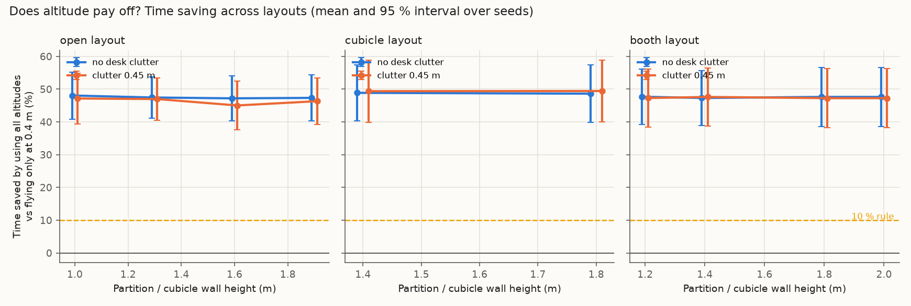
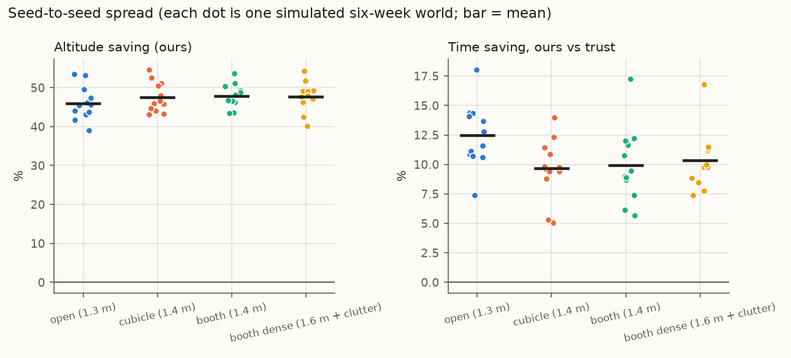
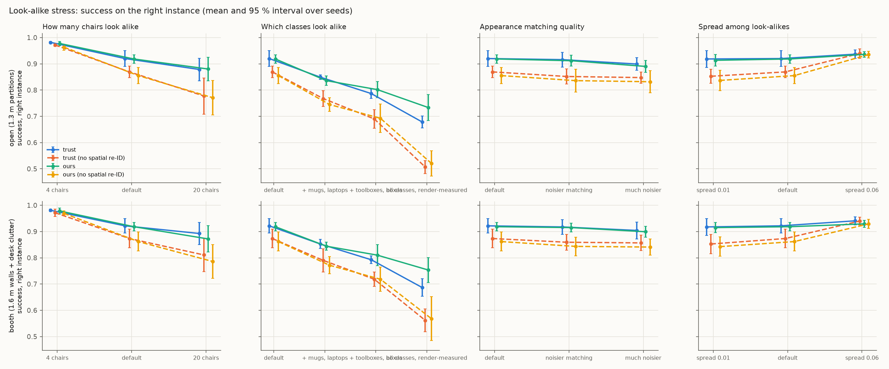

# Stage 2: stress-testing the simulated claims

**Visibility model: extended** (a50 = 339.6 px, slope 1.0, p_max 0.85), calibrated against Isaac Sim renders instead of the Stage 1-2 point model.

Runtime 192 s. Everything here comes from the simulator (`sim/`), not from real flights. Seeds are the independent unit; intervals are Student-t 95 % across seeds. Stand-in priors are hand-set, not real LLM output.

## Decision rules (written before running the sweeps)

- **Altitude stays a main claim** only if some layout in the swept range (walls 1.0–2.0 m, clutter 0–0.45 m, default drone speeds) saves **≥ 10 %** time by using all altitudes instead of 0.4 m only, with the 95 % interval above 0.
- If **no** layout reaches 3 %, the paper leads with the prior-method benchmark and look-alike re-identification instead.

## Verdict on the altitude claim

**PASS.** Best layout: cubicle layout, walls 1.8 m, clutter 0.45 m, saving 49.4 % [40.0, 58.9] (moved objects only: 51.8 % [35.2, 68.5]). 20 of 20 layouts meet the 10 % rule; 20 reach 3 % with interval above 0.

## 1. Layout sweep

20 layouts × 6 seeds, 300 commands per run. "Altitude saving" = 1 − mean time with all altitudes / mean time at 0.4 m only, same policy, same commands.

| Layout | Walls (m) | Clutter (m) | Altitude saving (ours) | … moved objects only | Always 1.8 m vs always 0.4 m | Altitude saving (trust baseline) | Ours vs trust: time saving | Ours − trust: success |
|---|---|---|---|---|---|---|---|---|
| booth | 1.2 | 0.0 | +47.7 % [+39.3, +56.1] | +47.8 % [+30.4, +65.1] | +49.7 % [+40.5, +58.8] | +48.3 % [+38.3, +58.2] | +8.1 % [+4.3, +11.8] | -0.010 [-0.016, -0.004] |
| booth | 1.4 | 0.0 | +47.3 % [+39.0, +55.7] | +46.9 % [+28.5, +65.3] | +48.4 % [+39.4, +57.4] | +48.0 % [+38.3, +57.7] | +7.9 % [+4.3, +11.6] | -0.006 [-0.013, 0.002] |
| booth | 1.8 | 0.0 | +47.6 % [+38.6, +56.7] | +47.5 % [+27.4, +67.6] | +48.7 % [+40.3, +57.1] | +48.1 % [+38.8, +57.3] | +8.6 % [+6.4, +10.9] | -0.008 [-0.015, -0.000] |
| booth | 2.0 | 0.0 | +47.6 % [+38.6, +56.7] | +47.5 % [+27.4, +67.6] | +48.6 % [+40.3, +57.0] | +48.1 % [+38.8, +57.3] | +8.6 % [+6.3, +10.8] | -0.008 [-0.015, -0.000] |
| booth | 1.2 | 0.45 | +47.3 % [+38.5, +56.1] | +47.0 % [+28.6, +65.4] | +48.6 % [+39.3, +57.9] | +46.9 % [+37.7, +56.1] | +10.4 % [+6.6, +14.1] | -0.010 [-0.016, -0.004] |
| booth | 1.4 | 0.45 | +47.6 % [+38.8, +56.5] | +48.6 % [+31.9, +65.3] | +47.2 % [+37.9, +56.4] | +47.1 % [+37.1, +57.1] | +10.7 % [+7.2, +14.1] | -0.006 [-0.013, 0.002] |
| booth | 1.8 | 0.45 | +47.3 % [+38.2, +56.3] | +47.3 % [+29.9, +64.7] | +47.9 % [+39.7, +56.0] | +47.5 % [+38.2, +56.8] | +9.5 % [+6.0, +13.0] | -0.008 [-0.015, -0.000] |
| booth | 2.0 | 0.45 | +47.3 % [+38.2, +56.3] | +47.3 % [+29.9, +64.7] | +47.7 % [+39.5, +55.9] | +47.5 % [+38.2, +56.8] | +9.5 % [+6.0, +13.0] | -0.008 [-0.015, -0.000] |
| cubicle | 1.4 | 0.0 | +48.9 % [+40.4, +57.4] | +50.6 % [+36.1, +65.0] | +49.5 % [+40.9, +58.2] | +48.0 % [+39.1, +56.9] | +8.7 % [+5.0, +12.4] | -0.002 [-0.009, 0.005] |
| cubicle | 1.8 | 0.0 | +48.6 % [+39.9, +57.4] | +50.0 % [+34.9, +65.1] | +49.5 % [+41.2, +57.8] | +48.3 % [+39.4, +57.2] | +7.6 % [+3.2, +12.1] | -0.002 [-0.009, 0.005] |
| cubicle | 1.4 | 0.45 | +49.4 % [+39.9, +58.8] | +51.8 % [+35.1, +68.4] | +49.8 % [+40.1, +59.4] | +48.1 % [+39.6, +56.6] | +8.8 % [+6.2, +11.5] | -0.002 [-0.009, 0.005] |
| cubicle | 1.8 | 0.45 | +49.4 % [+40.0, +58.9] | +51.8 % [+35.2, +68.5] | +50.0 % [+40.9, +59.0] | +48.3 % [+40.0, +56.5] | +8.6 % [+5.3, +11.8] | -0.002 [-0.009, 0.005] |
| open | 1.0 | 0.0 | +48.1 % [+40.9, +55.3] | +49.7 % [+34.4, +65.0] | +47.8 % [+40.4, +55.2] | +46.5 % [+39.0, +54.1] | +11.9 % [+9.0, +14.7] | -0.001 [-0.011, 0.010] |
| open | 1.3 | 0.0 | +47.5 % [+41.1, +53.8] | +48.0 % [+34.0, +62.0] | +48.0 % [+40.5, +55.4] | +46.4 % [+39.0, +53.8] | +10.8 % [+6.3, +15.3] | 0.001 [-0.016, 0.017] |
| open | 1.6 | 0.0 | +47.2 % [+40.4, +54.0] | +47.2 % [+32.5, +61.8] | +48.0 % [+40.8, +55.3] | +45.4 % [+37.4, +53.3] | +12.2 % [+10.0, +14.3] | -0.000 [-0.016, 0.016] |
| open | 1.9 | 0.0 | +47.3 % [+40.3, +54.4] | +47.6 % [+32.6, +62.6] | +47.1 % [+38.9, +55.2] | +45.6 % [+38.0, +53.1] | +12.3 % [+10.0, +14.5] | -0.000 [-0.016, 0.016] |
| open | 1.0 | 0.45 | +47.2 % [+39.4, +54.9] | +48.3 % [+34.1, +62.5] | +46.9 % [+38.7, +55.1] | +46.8 % [+39.7, +53.9] | +12.3 % [+10.3, +14.3] | -0.003 [-0.015, 0.008] |
| open | 1.3 | 0.45 | +47.0 % [+40.5, +53.5] | +47.7 % [+35.1, +60.2] | +47.9 % [+41.1, +54.8] | +46.7 % [+39.4, +54.1] | +11.7 % [+9.4, +14.0] | -0.004 [-0.016, 0.009] |
| open | 1.6 | 0.45 | +45.0 % [+37.6, +52.5] | +41.5 % [+23.7, +59.2] | +46.4 % [+38.6, +54.2] | +46.0 % [+38.5, +53.4] | +10.2 % [+7.6, +12.7] | -0.004 [-0.016, 0.007] |
| open | 1.9 | 0.45 | +46.3 % [+39.2, +53.4] | +45.5 % [+30.6, +60.3] | +46.1 % [+38.6, +53.6] | +45.9 % [+38.5, +53.3] | +12.2 % [+9.6, +14.8] | -0.004 [-0.016, 0.007] |

Best case for altitude, flying *always* at 1.8 m: cubicle layout, walls 1.8 m, clutter 0.45 m, saving 50.0 % [40.9, 59.0]. This is not the pre-registered metric (it compares two fixed heights instead of letting the policy choose), and it still stays below the 10 % rule.

Mean time (s) by altitude set, same policy (dose–response):

| Layout | Walls | Clutter | trust | ours @0.4 | ours @1.0 | ours @1.8 | ours (all) | oracle |
|---|---|---|---|---|---|---|---|---|
| booth | 1.2 | 0.0 | 14.36 | 25.66 | 13.21 | 12.67 | 13.19 | 7.69 |
| booth | 1.4 | 0.0 | 14.44 | 25.65 | 13.21 | 13.00 | 13.29 | 7.69 |
| booth | 1.8 | 0.0 | 14.44 | 25.65 | 13.21 | 12.95 | 13.19 | 7.69 |
| booth | 2.0 | 0.0 | 14.43 | 25.65 | 13.21 | 12.96 | 13.19 | 7.69 |
| booth | 1.2 | 0.45 | 14.78 | 25.55 | 13.23 | 12.89 | 13.23 | 7.69 |
| booth | 1.4 | 0.45 | 14.71 | 25.51 | 13.23 | 13.22 | 13.11 | 7.69 |
| booth | 1.8 | 0.45 | 14.61 | 25.51 | 13.26 | 13.08 | 13.20 | 7.69 |
| booth | 2.0 | 0.45 | 14.61 | 25.51 | 13.26 | 13.12 | 13.20 | 7.69 |
| cubicle | 1.4 | 0.0 | 13.54 | 24.65 | 12.36 | 12.19 | 12.36 | 7.60 |
| cubicle | 1.8 | 0.0 | 13.46 | 24.68 | 12.38 | 12.24 | 12.44 | 7.60 |
| cubicle | 1.4 | 0.45 | 13.57 | 24.98 | 12.30 | 12.27 | 12.37 | 7.60 |
| cubicle | 1.8 | 0.45 | 13.54 | 25.02 | 12.32 | 12.26 | 12.38 | 7.60 |
| open | 1.0 | 0.0 | 14.16 | 24.33 | 12.61 | 12.53 | 12.47 | 8.01 |
| open | 1.3 | 0.0 | 14.19 | 24.35 | 12.63 | 12.49 | 12.65 | 8.01 |
| open | 1.6 | 0.0 | 14.46 | 24.34 | 12.63 | 12.49 | 12.69 | 8.01 |
| open | 1.9 | 0.0 | 14.44 | 24.35 | 12.65 | 12.70 | 12.67 | 8.01 |
| open | 1.0 | 0.45 | 14.57 | 24.51 | 13.06 | 12.83 | 12.78 | 8.01 |
| open | 1.3 | 0.45 | 14.60 | 24.56 | 12.99 | 12.64 | 12.89 | 8.01 |
| open | 1.6 | 0.45 | 14.82 | 24.48 | 12.99 | 12.96 | 13.30 | 8.01 |
| open | 1.9 | 0.45 | 14.84 | 24.54 | 13.00 | 13.07 | 13.02 | 8.01 |

**Where does the altitude effect come from?** Per object class, pooled over all layouts and seeds (success and mean time, 0.4 m only vs all altitudes):

| Class | Commands | Success @0.4 m | Success, all altitudes | Mean time @0.4 m (s) | Mean time, all altitudes (s) | Median time @0.4 m | Median, all |
|---|---|---|---|---|---|---|---|
| bag | 2760 | 1.00 | 1.00 | 15.4 | 15.0 | 11.1 | 11.2 |
| bin | 2740 | 1.00 | 1.00 | 11.3 | 11.6 | 10.5 | 10.5 |
| box | 5000 | 1.00 | 1.00 | 11.2 | 10.5 | 10.4 | 9.9 |
| cart | 1680 | 1.00 | 1.00 | 21.9 | 19.5 | 12.7 | 12.7 |
| chair | 6900 | 0.61 | 0.63 | 9.4 | 9.5 | 9.1 | 9.2 |
| laptop | 2220 | 0.43 | 1.00 | 159.2 | 16.1 | 240.0 | 12.4 |
| monitor | 3520 | 1.00 | 1.00 | 11.5 | 11.1 | 11.9 | 11.9 |
| mug | 4540 | 0.97 | 1.00 | 41.8 | 18.6 | 19.2 | 13.1 |
| plant | 2060 | 1.00 | 1.00 | 11.3 | 10.9 | 11.7 | 11.7 |
| stool | 1960 | 1.00 | 1.00 | 12.4 | 13.0 | 10.2 | 10.3 |
| toolbox | 2620 | 1.00 | 1.00 | 14.1 | 12.4 | 11.2 | 10.7 |

## 2. Seed robustness (12 independent six-week worlds per layout)

| Layout | Success: ours | Success: trust | Ours − trust | Time saving vs trust | … moved only | Time saving vs verify-always | Altitude saving |
|---|---|---|---|---|---|---|---|
| open (1.3 m) | 0.924 [0.916, 0.932] | 0.930 [0.921, 0.939] | -0.006 [-0.011, -0.001] | +12.5 % [+10.7, +14.2] | +16.8 % [+13.6, +20.0] | +2.8 % [+1.4, +4.1] | +46.0 % [+43.3, +48.8] |
| cubicle (1.4 m) | 0.927 [0.920, 0.934] | 0.929 [0.920, 0.939] | -0.003 [-0.008, 0.002] | +9.6 % [+8.0, +11.3] | +9.3 % [+5.1, +13.5] | +1.8 % [+0.6, +3.0] | +47.5 % [+45.1, +50.0] |
| booth (1.4 m) | 0.926 [0.918, 0.934] | 0.931 [0.922, 0.940] | -0.005 [-0.010, 0.001] | +9.9 % [+7.9, +11.9] | +10.1 % [+6.1, +14.2] | +2.2 % [+1.1, +3.4] | +47.9 % [+46.0, +49.8] |
| booth dense (1.6 m + clutter) | 0.925 [0.917, 0.933] | 0.931 [0.922, 0.940] | -0.006 [-0.011, -0.000] | +10.4 % [+8.8, +12.0] | +12.4 % [+9.1, +15.6] | +3.0 % [+1.5, +4.6] | +47.7 % [+45.3, +50.0] |

**Effect of the prior inside the policy** (success difference vs our fitted prior):

| Layout | Commonsense (LLM stand-in) − ours | Persistence filter − ours |
|---|---|---|
| open (1.3 m) | -0.027 [-0.033, -0.020] | 0.002 [-0.001, 0.004] |
| cubicle (1.4 m) | -0.028 [-0.034, -0.023] | 0.001 [-0.003, 0.005] |
| booth (1.4 m) | -0.029 [-0.035, -0.024] | 0.001 [-0.004, 0.006] |
| booth dense (1.6 m + clutter) | -0.028 [-0.034, -0.023] | 0.002 [-0.002, 0.006] |

**E1 across seeds** (Brier, lower is better; first layout shown, the world dynamics are the same in all layouts):

| Prior | Brier, all | Brier @ 24 h |
|---|---|---|
| Hier. Weibull + returns (ours) | 0.111 [0.108, 0.114] | 0.166 [0.161, 0.171] |
| Persistence filter (exp.) | 0.114 [0.111, 0.116] | 0.168 [0.164, 0.173] |
| Human guesses (stand-in) | 0.146 [0.142, 0.149] | 0.235 [0.228, 0.242] |
| Commonsense (LLM stand-in) | 0.146 [0.143, 0.149] | 0.236 [0.230, 0.241] |
| Global constant | 0.171 [0.169, 0.173] | 0.262 [0.258, 0.266] |

Ours has the lowest Brier in **83 %** of seeds. Ours − persistence filter: -0.0026 [-0.0050, -0.0002]. Ours − commonsense: -0.0348 [-0.0381, -0.0315].

**E3 across seeds** (staleness-aware minus map-only):

| Layout | Argmax accuracy difference | Accuracy-when-acting difference | Ask rate |
|---|---|---|---|
| open (1.3 m) | 0.0265 [0.0113, 0.0417] | 0.0049 [-0.0020, 0.0118] | 0.620 [0.597, 0.642] |
| cubicle (1.4 m) | 0.0280 [0.0123, 0.0438] | 0.0062 [0.0009, 0.0115] | 0.618 [0.601, 0.636] |
| booth (1.4 m) | 0.0280 [0.0123, 0.0438] | 0.0062 [0.0009, 0.0115] | 0.618 [0.601, 0.636] |
| booth dense (1.6 m + clutter) | 0.0280 [0.0123, 0.0438] | 0.0062 [0.0009, 0.0115] | 0.618 [0.601, 0.636] |

## 4. Look-alike stress

Success = the commanded *instance* reached. "No spatial re-ID" ignores where the belief says the object probably is when choosing between look-alikes. Failure share = fraction of the policy's failures that involve a look-alike class.

**open (1.3 m partitions)**

| Setting | trust | trust, no spatial | ours | ours, no spatial | Spatial prior gain (ours) | Intent success (ours) | Failures on look-alikes |
|---|---|---|---|---|---|---|---|
| default (12 chairs) | 0.920 [0.890, 0.950] | 0.869 [0.847, 0.891] | 0.918 [0.902, 0.935] | 0.855 [0.824, 0.886] | 0.063 [0.023, 0.104] | 1.000 [1.000, 1.000] | 100.0 % [100.0, 100.0] |
| 4 chairs | 0.982 [0.979, 0.985] | 0.972 [0.966, 0.977] | 0.978 [0.970, 0.985] | 0.963 [0.952, 0.975] | 0.014 [0.007, 0.021] | 1.000 [1.000, 1.000] | 100.0 % [100.0, 100.0] |
| 20 chairs | 0.878 [0.835, 0.921] | 0.777 [0.709, 0.846] | 0.880 [0.835, 0.925] | 0.771 [0.705, 0.836] | 0.109 [0.080, 0.138] | 1.000 [1.000, 1.000] | 100.0 % [100.0, 100.0] |
| + mugs, laptops | 0.849 [0.840, 0.858] | 0.767 [0.738, 0.797] | 0.836 [0.818, 0.853] | 0.745 [0.718, 0.772] | 0.091 [0.070, 0.112] | 1.000 [1.000, 1.000] | 100.0 % [100.0, 100.0] |
| + toolboxes, boxes | 0.787 [0.769, 0.805] | 0.690 [0.655, 0.725] | 0.802 [0.771, 0.832] | 0.693 [0.639, 0.746] | 0.109 [0.075, 0.143] | 1.000 [1.000, 1.000] | 100.0 % [100.0, 100.0] |
| all classes, render-measured | 0.678 [0.656, 0.701] | 0.507 [0.481, 0.532] | 0.733 [0.683, 0.783] | 0.521 [0.473, 0.569] | 0.212 [0.187, 0.238] | 1.000 [1.000, 1.000] | 100.0 % [100.0, 100.0] |
| noisier matching | 0.916 [0.888, 0.944] | 0.852 [0.822, 0.881] | 0.912 [0.891, 0.932] | 0.836 [0.793, 0.879] | 0.076 [0.031, 0.121] | 1.000 [1.000, 1.000] | 100.0 % [100.0, 100.0] |
| much noisier | 0.899 [0.875, 0.923] | 0.848 [0.826, 0.869] | 0.890 [0.867, 0.913] | 0.832 [0.790, 0.873] | 0.058 [0.031, 0.085] | 1.000 [1.000, 1.000] | 100.0 % [100.0, 100.0] |
| spread 0.01 | 0.918 [0.886, 0.950] | 0.853 [0.825, 0.880] | 0.913 [0.891, 0.936] | 0.837 [0.798, 0.876] | 0.077 [0.037, 0.117] | 1.000 [1.000, 1.000] | 100.0 % [100.0, 100.0] |
| spread 0.06 | 0.937 [0.921, 0.952] | 0.939 [0.921, 0.957] | 0.936 [0.925, 0.947] | 0.935 [0.922, 0.948] | 0.001 [-0.002, 0.003] | 1.000 [1.000, 1.000] | 100.0 % [100.0, 100.0] |

**booth (1.6 m walls + desk clutter)**

| Setting | trust | trust, no spatial | ours | ours, no spatial | Spatial prior gain (ours) | Intent success (ours) | Failures on look-alikes |
|---|---|---|---|---|---|---|---|
| default (12 chairs) | 0.922 [0.894, 0.950] | 0.873 [0.838, 0.909] | 0.918 [0.902, 0.935] | 0.862 [0.826, 0.898] | 0.057 [0.032, 0.082] | 1.000 [1.000, 1.000] | 100.0 % [100.0, 100.0] |
| 4 chairs | 0.981 [0.976, 0.986] | 0.972 [0.958, 0.986] | 0.978 [0.967, 0.989] | 0.969 [0.960, 0.978] | 0.009 [0.002, 0.016] | 0.999 [0.997, 1.002] | 95.8 % [82.6, 109.1] |
| 20 chairs | 0.892 [0.850, 0.935] | 0.811 [0.747, 0.875] | 0.872 [0.821, 0.922] | 0.786 [0.722, 0.850] | 0.086 [0.055, 0.116] | 1.000 [1.000, 1.000] | 100.0 % [100.0, 100.0] |
| + mugs, laptops | 0.853 [0.835, 0.870] | 0.790 [0.746, 0.834] | 0.844 [0.829, 0.859] | 0.772 [0.739, 0.805] | 0.072 [0.044, 0.101] | 1.000 [1.000, 1.000] | 100.0 % [100.0, 100.0] |
| + toolboxes, boxes | 0.792 [0.778, 0.807] | 0.718 [0.690, 0.746] | 0.810 [0.770, 0.850] | 0.718 [0.672, 0.765] | 0.092 [0.067, 0.116] | 1.000 [1.000, 1.000] | 100.0 % [100.0, 100.0] |
| all classes, render-measured | 0.687 [0.653, 0.720] | 0.562 [0.518, 0.605] | 0.753 [0.706, 0.801] | 0.568 [0.485, 0.652] | 0.185 [0.122, 0.248] | 1.000 [1.000, 1.000] | 100.0 % [100.0, 100.0] |
| noisier matching | 0.917 [0.890, 0.945] | 0.859 [0.829, 0.889] | 0.915 [0.899, 0.931] | 0.843 [0.808, 0.879] | 0.072 [0.047, 0.096] | 1.000 [1.000, 1.000] | 100.0 % [100.0, 100.0] |
| much noisier | 0.904 [0.872, 0.936] | 0.857 [0.827, 0.886] | 0.899 [0.879, 0.920] | 0.841 [0.811, 0.871] | 0.058 [0.044, 0.072] | 1.000 [1.000, 1.000] | 100.0 % [100.0, 100.0] |
| spread 0.01 | 0.917 [0.886, 0.949] | 0.853 [0.815, 0.890] | 0.915 [0.895, 0.935] | 0.843 [0.806, 0.879] | 0.072 [0.048, 0.097] | 1.000 [1.000, 1.000] | 100.0 % [100.0, 100.0] |
| spread 0.06 | 0.941 [0.926, 0.956] | 0.940 [0.926, 0.954] | 0.929 [0.916, 0.942] | 0.929 [0.911, 0.947] | -0.000 [-0.008, 0.008] | 1.000 [1.000, 1.000] | 100.0 % [100.0, 100.0] |

